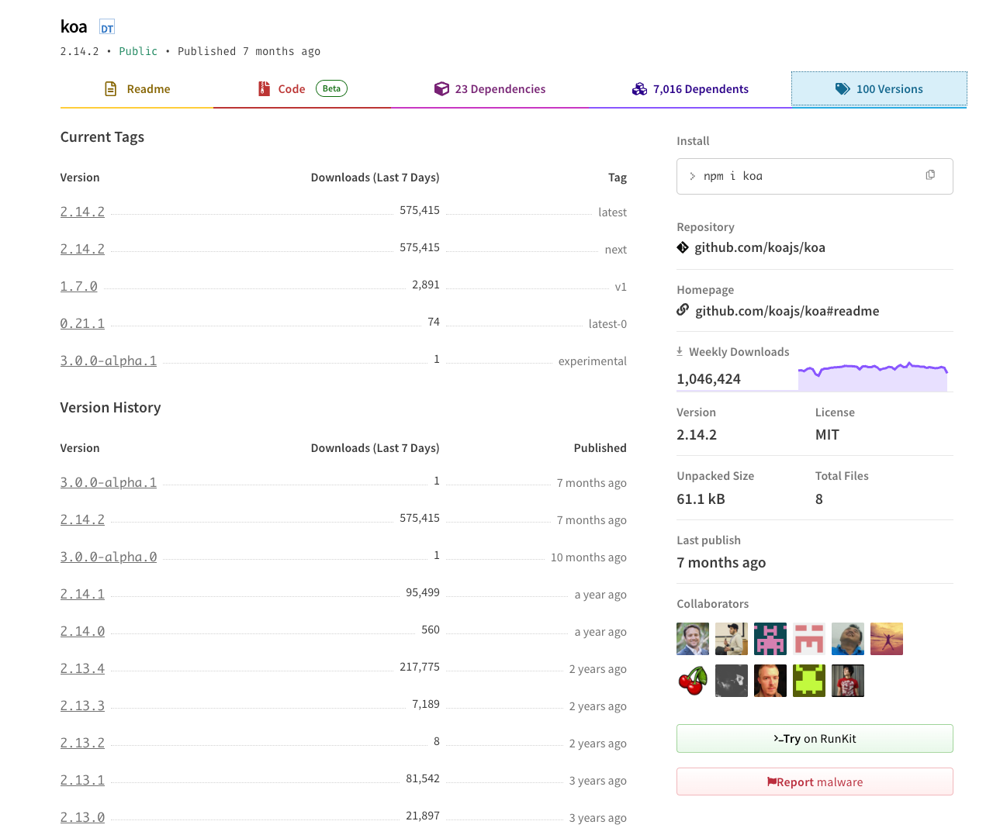
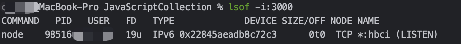

# 基本介绍

> Koa 是一个新的 web 框架，由 Express 幕后的原班人马打造， 致力于成为 web 应用和 API 开发领域中的一个更小、更富有表现力、更健壮的基石。
> 通过利用 async 函数，Koa 帮你丢弃回调函数，并有力地增强错误处理。
> Koa 并没有捆绑任何中间件， 而是提供了一套优雅的方法，帮助您快速而愉快地编写服务端应用程序。

## 安装

Koa框架在社区非常受欢迎，版本也一直在更新，可以通过npm官网查看版本记录：<https://www.npmjs.com/package/koa>



可以看到2.x版本一直在维护，同时3.x的alpha测试版本也出来了，这里插嘴说一句：

> 3.x版本是不是要支持ts，毕竟ts这几年用的人也越来越多了...

```bash
## npm安装最新的koa
npm install koa
```

## 快速使用

下载好koa模块后，可以简单写个Hello World案例感受一下

@[code js](@code/koa/koa-start.js)

当使用`node koa-start.js`命令执行时，进程会监听3000端口，此时可以发现一个Web服务就启动，这简简单单的几行代码，怎么看都轻量、便捷，
每次想到这里，我都会不由想起Java...

查看端口3000，判断服务是否正常启动



## 一些实践

@[code js](@code/koa/koa-listen.js)

## 参考资料

- 中文官网：<https://koa.bootcss.com/index.html#introduction>
