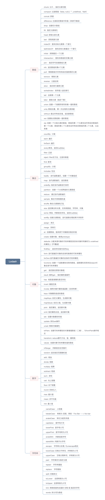

# Lodash

- 官网：<https://www.lodashjs.com>

Lodash 是一个一致性、模块化、高性能的 JavaScript 实用工具库， 通过降低 array、number、objects、string 等等的使用难度从而让
JavaScript 变得更简单。 Lodash 的模块化方法 非常适用于：

- 遍历 array、object 和 string
- 对值进行操作和检测
- 创建符合功能的函数

## 安装

使用`npm`或者`pnpm`等包管理工具下载依赖都行，注意区分环境

```bash
## 全局安装
npm i -g npm
## 生产环境安装
npm i --save lodash

```

如果是使用`TypeScript`语言，则需要安装对应的类型<https://www.npmjs.com/package/@types/lodash>：

```bash
## 安装类型
npm install --save @types/lodash
```

## 简单使用

```js
// 支持import导入
// import _ from 'lodash'
const _ = require('lodash')

console.log(_.chunk(['a', 'b', 'c', 'd'], 2))
// => [['a', 'b'], ['c', 'd']]

console.log(_.chunk(['a', 'b', 'c', 'd'], 3))
// => [['a', 'b', 'c'], ['d']]
```

## 高频使用

以下列举出常用的函数，**有的很容易忘记**



## 实际使用

### 数组

- compact: 过滤假值（false, null,0, "", undefined，NaN）
- concat: 拼接
- difference: 过滤给定数组中的值（来源于数组）
- drop:  创建切片数组
- fill:  指定元素填充
- head: 获取头部元素
- last：获取尾部元素
- indexOf：查找目标元素第一个索引
- lastIndexOf： 查找目标元素最后一个索引
- initial：排除最后一个元素
- intersection： 查找多数组的交集元素
- join： 指定符号连接数组元素
- nth:  返回数组的第n个元素
- pull：移除数组中所有和给定值相等的元素
- remove：移除元素
- reverse：元素反转
- slice： 指定索引裁剪元素
- sortedIndex：排序插入返回索引
- tail：去除第一个元素
- take：提取元素（指定个数）
- union: 创建一个按顺序排列的唯一值的数组
- uniq: 数组去重，第一次出现的元素保留
- without: 提出所有给定值，返回新数组
- xor: 创建给点数组唯一值的数组
- zip: 创建一个分组元素的数组，数组的第一个元素包含所有给定数组的第一个元素，数组的第二个元素包含所有给定数组的第二个元素，以此类推

@[code js](@code/node/lodash/demo-array.js)

### 对象

- assign：拷贝
- merge:  深拷贝
- at:  创建数组，值来源于对象路径相应的值
- create: 创建对象，继承`prototype`
- defaults: 分配来源对象的可枚举属性到目标对象所有解析为 undefined 的属性上【不覆盖】
- findKey： 返回存在值对应的key
- forIn: 迭代器遍历对象的自身和继承的可枚举属性
- forOwn:迭代器遍历对象的自身的可枚举属性
- functions: 创建一个函数属性名称的数组，函数属性名称来自object对象自身可枚举属性
- get： 指定路径获取对象值
- result: 累死get ，指定属性值操作
- has:  检查直接属性是否存在
- invert: 键值互换
- invoke: 调用对象中属性值函数（支持传参）
- keys: 对象属性组成的数组
- mapKeys: 自定义属性，生成新对象
- mapValues: 自定义值，生成新对象
- pick：指定属性，返回新对象
- omit: 指定属性反选，返回新对象
- set:  设置对象属性和值
- update: 类似set操作
- unset: 移除对象属性
- toPairs:  创建可枚举属性的对象键值数组（二维），与fromPairs操作相反
- transform: reduce替代方法，值、键转换
- values:  创建对象可枚举属性值的数组

@[code js](@code/node/lodash/demo-object.js)

### 集合

- countBy:  计数
- each: 遍历
- forEach: 遍历
- every:断言，返回true|false
- filter: 过滤
- reject: filter反方法，过滤非真值
- find: 查询
- groupBy : 分组
- includes: 包含
- keyBy：迭代函数遍历，创建一个对象组成
- map:  迭代函数遍历，返回数组
- orderBy: 指定迭代函数进行排序
- partition：创建一个分成两组的元素数组
- reduce:   通过迭代函数遍历
- sample:  集合中获取随机值
- shuffle: 集合元素随机打乱
- size: 返回集合的长度，支持类数组、字符串、对象
- some: 筛选，判断是否存在，返回true|false
- sortBy: 创建元素数组，迭代函数处理结果升序排序

@[code js](@code/node/lodash/demo-set.js)

### 数字

- inRange： 判断是否在范围中
- random: 返回指定范围随机值
- add : 相加
- divide: 相除
- multiply: 相乘
- subtract: 相减
- sum:  求和
- ceil:  向上取整
- floor: 向下取整
- round: 四舍五入
- max: 最大值
- mean: 求平均值
- min: 最小值
  @[code js](@code/node/lodash/demo-num.js)

### 字符串

- camelCase： 小驼峰
- kebabCase： 转换为-连接，例如：Foo Bar ----> foo-bar
- snakeCase： 转化为蛇形风格
- capitalize： 首字母大写
- lowerFirst:  首字母小写
- upperFirst：首字母转为大写
- endsWith： 判断结尾字符
- startsWith: 判断开头字符
- escape： 字符转义处理, 与unescape相反
- lowerCase: 空格分开单词，并转换为小写
- upperCase： 空格分隔单词，并转换为大写
- pad： 字符填充为指定长度
- repeat： 字符串重复
- replace： 字符替换
- split: 切割拆分
- toLower： 全部转换为小写
- toUpper:  全部转换为大写
- trim: 移除前面和后面的 空格 或 指定的字符
- words: 拆分词为数组

@[code js](@code/node/lodash/demo-string.js)

## 参考资料

- <https://www.lodashjs.com/docs>
- <https://www.npmjs.com/search?q=lodash>
