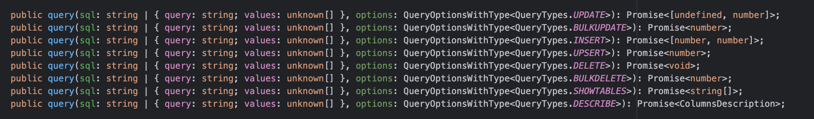
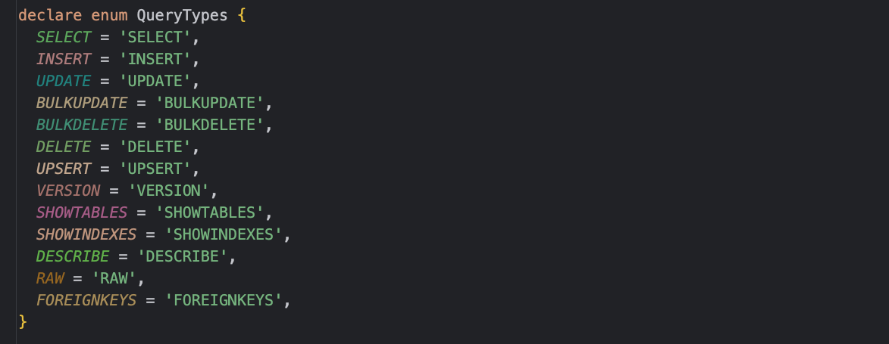
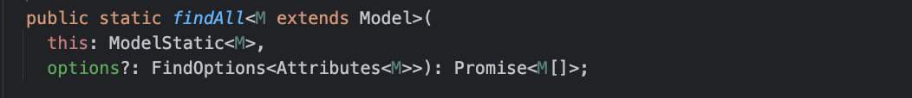
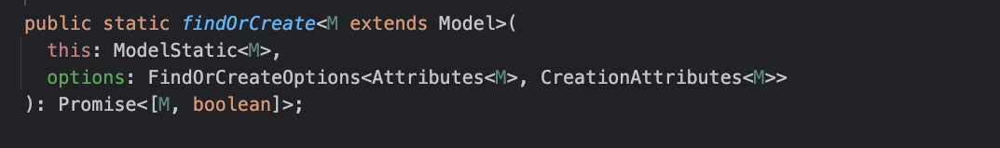
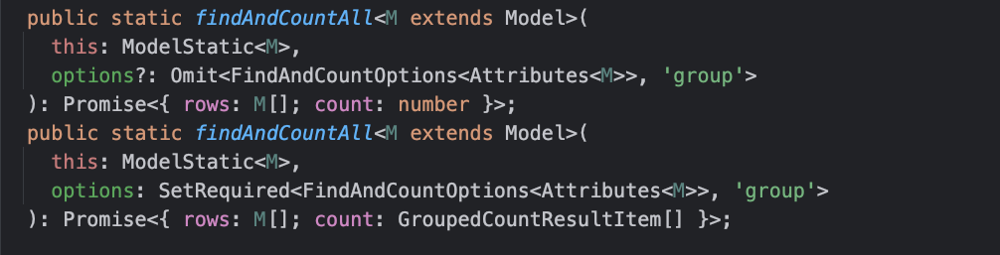

# DB查询

`Sequelize`提供了各种封装好的`API`方法来支持数据库查询操作，在介绍查询操作前，
可以先向表中插入一些数据，例如：

```js
// 向表中插入一行数据
const user = await User.create({
  name: '142vip.cn'
})

// 写入成功后，可以通过user对象，获取主键ID
console.log('userId:', user.id)
```

可以检查数据库表中是否成功写入数据

## 原始查询

`Sequelize`框架本身是ORM框架，是用来管理对象实体和数据库表的关系映射，满足基础的`SQL`语句执行功能，同时还封装了大量查询操作的相关API方法。

这里主要介绍下如何用`Sequelize`框架执行原始`SQL`查询，简单来说就是通过写SQL来处理业务，执行`SQL`来实现业务功能。`sequelize`
框架提供的了`query()`方法来实现这一功能，查看源码：



默认情况下，query()方法返回两个参数：

- 结果数组
- 包含元数据的对象，例如：受影响的行数等

针对不同的数据库类型（这个可以在建立Sequelize连接时通过dialect字段指定），原始的SQL语句会存在一些语法上的出入。

### 简单查询

基于Sequelize.query()方法查询，可以满足一些基础的SQL语句执行。例如：

```js
// 将age等于18的数据对应的age字段改为30
const sql = 'UPDATE users SET age = 30 WHERE age = 18'

// 执行SQL
const [results, metadata] = await sequelize.query(sql)
```

上面使用`results`字段来解构`SQL`语句执行后的结果，因为`SQL`语句是执行更新操作，所以`results`字段的值将会是一个`空数组`。

### 格式化结果

根据源码可以知道`sequelize.query()`在执行`SQL`时，还可以传入第二个可选参数`options`对象，可以支持对`SQL`语句结果格式化的配置，
只需要配置`options.type`参数，例如：

```js
const { QueryTypes } = require('sequelize')

const sql = 'select * from users'
// 配置执行query方法的返回结果类型
const users = await sequelize.query(sql, {
  type: QueryTypes.SELECT
})
```

`type`字段用来配置查询类型。查询类型会影响结果在传回之前的格式设置方式，type字段的配置支持多种类型，查看源码：



### 配置模型

对于执行查询`SQL`结果的处理，除了通过`type`字段去配置格式化，`Sequelize`还提供了将查询结果与指定模型的数据映射配置，例如：

```js
const { QueryTypes } = require('sequelize')

const sql = 'select * from users'
// 配置Users模型，将查询结果与模型进行数据映射
const projects = await sequelize.query(sql, {
  model: Users,
  mapToModel: true
})
```

更多使用`query()`方法的配置，
可以查看[QueryOptions的类型声明](https://github.com/sequelize/sequelize/blob/main/packages/core/src/dialects/abstract/query-interface.d.ts)
，提供了丰富的API方法。

### 替换参数

查询中的替换可以通过两种不同的方式完成，

- 如果传递的是数组，`?` 将按照它们在数组中出现的顺序进行替换
- 如果传递了一个对象，`:key`则将替换为该对象中的键。如果对象中的键与key字段不匹配、找不到，会导致异常。

这里通过简单的替换例子来演示，例如：

```js
const { QueryTypes } = require('sequelize')

// 使用 ? 格式来替换，替换值为数组
await sequelize.query('SELECT * FROM tbl_user WHERE name = ?', {
  replacements: [
    '142vip.cn'
  ],
  type: QueryTypes.SELECT
})

// 使用:key 格式来替换，替换值为对象
await sequelize.query('SELECT * FROM tbl_user WHERE name = :name', {
  replacements: {
    name: '142vip.cn'
  },
  type: QueryTypes.SELECT
})
```

基于数组或者对象的形式实现查询SQL语句替换，类似的可以使用`%`来支持模糊匹配，例如：

```js
const { QueryTypes } = require('sequelize')

// 使用:key 格式来替换，替换值为对象
await sequelize.query('SELECT * FROM tbl_user WHERE name like :name', {
  replacements: {
    name: '142vip.cn%'
  },
  type: QueryTypes.SELECT
})
```

### 绑定参数

执行原始`SQL`语句，绑定参数和替换参数类型，不过绑定参数使用的是`$`标记，规则是：

- 如果传递数组，`$1` 则绑定到数组中的第一个元素，数组角标为0
- 如果传递一个对象，`$key` 则绑定到`object['key']`。**每个键必须以非数字字符开头、满足对象的键规范。**
- 在任何一种情况下`$$`都可以用来转义文字`$`符号。

数组或对象必须包含所有绑定值，绑定参数与待绑定的 `SQL` 语句必须一一匹配，避免 `Sequelize` 因为绑定参数匹配问题出现异常。例如：

```js
const { QueryTypes } = require('sequelize')

// 使用数组形式实现绑定参数
await sequelize.query('SELECT * FROM tbl_user WHERE name = $1', {
  bind: [
    '142vip.cn'
  ],
  type: QueryTypes.SELECT
})

// 使用对象形式实现绑定参数
await sequelize.query('SELECT * FROM tbl_user WHERE name = $name', {
  bind: {
    name: '142vip.cn'
  },
  type: QueryTypes.SELECT
})
```

同样地，在绑定参数中也是支持模糊匹配的，使用好 `%` 标记即可

### 特殊列处理

对于表的列字段带点，虽然从规范上不推荐这么做，但实际总是会有这种可能。例如：`user.name`

```js
const { QueryTypes } = require('sequelize')

const records = await sequelize.query('select 1 as `user.name`', {
  type: QueryTypes.SELECT
})
console.log(JSON.stringify(records[0], null, 2))
```

查询出来的结果是：

```json5
// 查询结果按照列名整理成对象的形式
{
  "user.name": 1
}
```

Sequelize框架可以使用 `nest`参数设置，处理这种特殊的列。当设置 `nest: true`时， 可以将生成的对象转化为嵌套对象，例如：

```js
const { QueryTypes } = require('sequelize')

const records = await sequelize.query('select 1 as `user.name`', {
  type: QueryTypes.SELECT
})
console.log(JSON.stringify(records[0], null, 2))
```

配置`nest`参数后，查询出来的结果是：

```json5
// 支持将查询的数据转化为嵌套对象
{
  "user": {
    "name": 1
  }
}
```

## 模型查询

`Sequelize`框架封装了很多`API`来支持查询，避免反复写`SQL`语句，这些`API`本质上是将`SQL`语句抽象化，
用户只需要按照`API`提供的参数进行配置，即可实现和执行原始`SQL`语句一样的功能，例如：

提供了`findAll()`方法，支持在模型上使用，用来查询所有。

```js
// 查询用户表中的所有用户信息
const users = await User.findAll()
// 判断查询结果是否为User模型的类对象
console.log(users.every(user => user instanceof User)) // true
```

执行上面的`findAll()`函数，实质上就是执行转化后的`SQL`语句：

```bash
# 查询用户表中的所有列
select * from tbl_user
```

查看`findAll()`方法的源码：



这里的可选参数`options`支持配置，例如：

- `include`： 支持连表查询
- `order`： 支持查询结果排序
- `group`： 支持分组查询
- `limit`： 支持分页查询，基于不同角标起始值查询
- `where`： 支持条件查询
- ...

### 指定查询列

不传递参数，使用 `findAll()` 方法时，会默认查询表中的所有列，如果需要查询部分列，可以使用 `options` 中的 `attributes` 参数，例如：

```js
// 查询用户表中的`name`列信息
const user2 = User.findAll({
  attributes: ['name']
})

// 实质上是执行： select name from user
```

`attributes` 参数也支持对列查询时列属性重命名，类似于 `as` 的操作，例如：

```js
// 查询用户表中的`name`列信息
const user2 = User.findAll({
  attributes: ['name', ['age', 'newAge']]
})

// 实质上是执行： select name , age as newAge from user
```

查询`name`、`age`列，并且将 `age` 列重命名为 `newAge` 进行结果输出。

### 包含某些列

除了查询表固定的数据列，还可以基于表的数据做一些操作，生成新的数据列，可以使用 `attributes` 参数中的
`include`关键字。例如：

只查询出user表中的name列

```js
// 只查询出name列
const user4 = User.findAll({
  attributes: {
    include: ['name']
  }
}
```

等价于：

```bash
select name from tbl_user;
```

也可以额外在增加列

```js
// 除了查询user表所有列外，还新增一列countAge
const user5 = User.findAll({
  attributes: {
    include: [sequelize.fn('count', sequelize.col('age')), 'countAge']
  }
})
```

等价于：

```bash
select * , count(age) as "countAge" from tbl_user;
```

灵活应用 `include` 配置和 `sequelize.fn()` 函数，可以一定程度上减少SQL原生语句的编写。

### 排除某些列

和 `include` 配置支持的功能相反，`attributes` 参数中存在 `exclude` 配置，用来排除某些列，用法和include配置类似，例如：

```js
// 排除name数据列
const user6 = User.findAll({
  attributes: {
    exclude: ['name']
  }
})
```

转化SQL语句等价于：

```bash
# 查询tbl_user表中非name字段的数据列
select age from tbl_user;
```

### 列聚合运算

在查询表信息时，如果要对某列做一些操作，可以使用sequelize.fn函数来实现，例如：

```js
// 对name列实现count聚合操作，并取别名countAge
const user3 = User.findAll({
  attributes: [
    'name',
    [sequelize.fn('count', sequelize.col('age')), 'countAge']
  ]
})
```

使用 `sequelize.fn()` 函数实现聚合操作，将结果放在 `attributes` 参数中，可以用来生成新的列

### 条件查询

在`findAll()`方法的API中，使用关键字`where`支持条件查询、筛选数据，例如：

```js
const user7 = User.findAll({
  where: {
    name: '142vip.cn'
  }
})
```

转换为SQL语句等价于：

```bash
select * from tbl_user where name='142vip.cn'
```

除了支持上面这种相等的比较，`findAll()`方法还依赖`Op`支持大于、小于等比较，例如：

```js
const { Op } = require('sequelize')

// 等价于上面的操作
const user7 = User.findAll({
  where: {
    name: {
      [Op.eq]: '142vip.cn'
    }
  }
})
```

`Sequelize` 默认情况支持`相等比较`，也就是上面基于`Op`的实现等价与`Sequelize`的相等比较。

除了`Op.eq`运算符 ，`Sequelize`框架中的`Op`还提供了丰富的运算符，具体可以参考[Op运算符](OP运算符.md)

## 查找器查询

在数据库的查询语句中，一般使用`SELECT`关键字。但对于ORM框架来说，可以封装出很多不同用法的`API`方法，来实现查询操作，
`Sequelize`框架提供了很多查找器方法，例如：`findAll` 、`findByPk`、`findOne`...

**在默认情况下，所有查找器方法的结果都是模型类的实例，不是简单的JS对象**

执行查找器方法查询数据库，返回数据时，`Sequelize`框架会自动将返回的内容包装在对应的模型实例上，
但是数据量过大时，这种数据的转换需要消耗大量的时间，可以设置`raw: true`配置来关闭这种转换，返回原始的JS对象数据。

### findAll方法

在上面已经提供过很多关于findAll()方法的使用，本质上是生成一个标准的`SELECT`查询，例如：

```js
const { Op } = require('sequelize')

// 查询满足条件的所有用户
User.findAll({
  // 返回原生对象结果
  raw: true,
  // 条件查询
  where: {
    name: {
      [Op.eq]: '142vip.cn'
    }
  }
})
```

### findByPk方法

`findByPk()`方法是根据主键内容查询查询单条数据，因为主键具有唯一性，例如：

```js
const user = await User.findByPk(123)
if (user === null) {
  console.log('Not found!')
}
else {
  console.log(project instanceof Project) // true
}
```

在上面的查询中，因为没有设置`raw`参数配置，默认情况下，将查询结果转为为`Sequelize`框架的模型实例对象

### findOne方法

`findOne()`方法是用来查询满足条件的第一条数据，如果没有提供查询条件，则默认返回表中第一条数据，例如：

```js
// 查询满足条件的第一条数据
User.findOne({
  where: {
    name: '142vip.cn'
  }
})
```

### findOrCreate方法

`findOrCreate()` 方法是在数据库表中查询或者创建数据，存在两种情况：

- 表中存在满足查询条件的数据，则直接返回
- 表中不存在满足条件的数据，则根据查询条件和默认值在表中新创建一条数据

查看 `findOrCreate()` 方法的源码：



`findOrCreate()`方法返回一个二元数组，形式为：

- <`Model`，`Boolean`>[`查询结果集` , `是否新插入`]

可以根据布尔值结果来判断是否为新创建的数据， 例如：

```js
// 查询用户信息，如果不存在则创建用户，并且age字段默认值为18
const [user, created] = await User.findOrCreate({
  where: { username: '142vip.cn' },
  defaults: {
    age: 18
  }
})

if (created) {
  console.log('新创建的数据信息')
}
```

### findAndCountAll方法

`findAndCountAll()`方法结合了find() 和 count() 方法，在处理分页这种业务时非常有用。查看源码：



从类型声明上可以看出，不论查询参数中是否传入`group`参数，都会返回两个参数：

- `count`：
  - 没有传入`group`参数进行分组查询时，返回一个整数，代表匹配的记录总数
  - 传入`group`参数进行分组查询时，返回对象数组，代表每组中的计数和分组名
- `rows`： 对象数组 ，包含满足条件的所有记录

特别需要注意下，进行分组查询时，count返回结果的形式：

```ts
export interface GroupedCountResultItem {
  // 分组的属性值
  [key: string]: unknown

  // 总数
  count: number
}
```

这里简单介绍下`findAndCountAll()`方法的使用，例如：

```js
// 分页查询
const { count, rows } = await User.findAndCountAll({
  where: {
    title: {
      [Op.like]: '142vip'
    }
  },
  offset: 10,
  limit: 2
})
```

关于利用`indAndCountAll()`方法来实现分页逻辑，可以参数[最佳实践-分页查询]()

## 子查询
