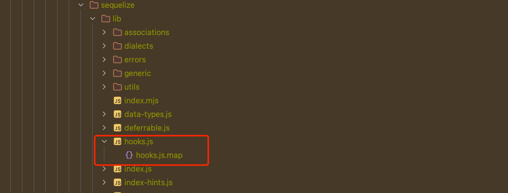
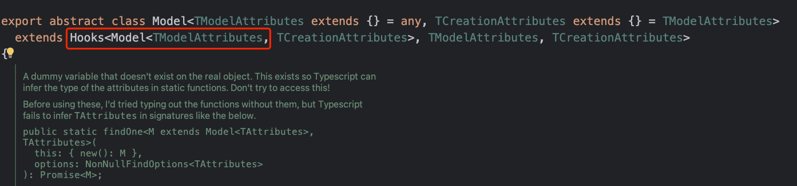
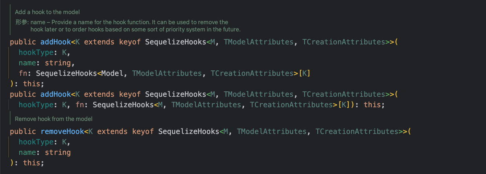
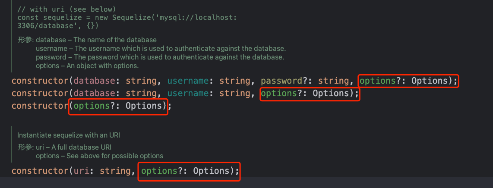
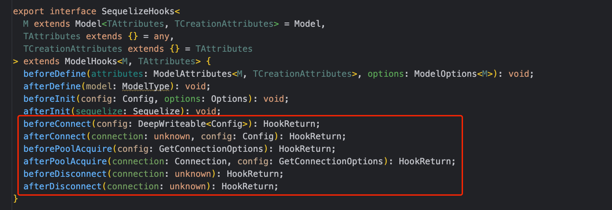

# 钩子函数

`钩子函数`也叫`生命周期事件`，在一些大型框架中都有这样的设计。是在执行 `sequelize` 中的调用之前或之后调用的函数，在项目开发中常常会遇到这样的情况：

> 希望在对某张表新增一条数据时，对某个字段自动操作

具体一点就是： 在表中新增一行数据，但是不希望通过提交SQL、代码的方式去维护一个字段，例如：创建时间。

> 这时候就可以使用钩子函数中的`beforeUpdate`函数，对该字段进行声明。

**注意：钩子函数只能与模型一起使用，相当于模型的一个拓展，是对某种操作的一个抽象封装，无法与实例一起使用**

## 提供的函数

`sequelize`提供了很多钩子函数，在源码存在一个`hooks.js`的文件，就是用来声明钩子函数`hooks`的



例如：

```json5
//  插入数据成功前、后执行的函数
beforeCreate(attributes: M, options: CreateOptions<TAttributes>);
afterCreate(attributes: M, options: CreateOptions<TAttributes>);

// 更新数据成功前、后执行的函数
beforeUpdate(instance: M, options: InstanceUpdateOptions<TAttributes>);
afterUpdate(instance: M, options: InstanceUpdateOptions<TAttributes>);

// 批量更新成后前、后执行的函数
beforeBulkUpdate(options: UpdateOptions<TAttributes>);
afterBulkUpdate(options: UpdateOptions<TAttributes>);

// ...
```

更多钩子函数可以查看[hooks源码](https://github.com/sequelize/sequelize/blob/v6/src/hooks.d.ts)

## 声明钩子

钩子函数的参数是通过引用传递的，因此可以在钩子函数中对模型操作的一些值进行修改，也就是对执行的一些SQL做修改，从而影响结果。

钩子函数也可以支持异步操作，这种情况下传入的钩子函数返回一个Promise对象即可。 例如：

```ts
// User为表实例，注意这里的async
User.beforeCreate(async (user, options) => {
  const hashedPassword = await hashPassword(user.password);
  user.password = hashedPassword;
});
```

钩子函数的声明，目前支持三种形式：

- 基于实例类继承`sequelize`提供的`Model`类，调用init()方法初始化
- 使用`addHook()`方法，给实例类添加初始化操作
- 直接使用绑在实例类上的钩子方法

具体的用法，可以参考下面的示例：

@[code js](@code/orm/sequelize/apis-demo/hooks.js)

## 移除钩子

在上面的钩子函数声明、使用中，可以发现模型实例类在继承`Model`父类之后，调用`addHook()`
函数，这是因为`Model`父类继承了`Hooks`类，支持对钩子函数做一些操作，查看源码：



同时，`Hooks`父类不仅提供`addHook()`方法，还提供一些其他的API：



支持对`钩子函数`的增加、移除等管理操作，例如：

@[code js](@code/orm/sequelize/apis-demo/hooks-api.js)

## 全局钩子

全局钩子是为所有模型运行的钩子，在插件中特别有用，可以定义想要的所有模型的行为。例如，自定义模型上的时间戳字段

```js

const User = sequelize.define('User', {}, {
  tableName: 'tbl_user',
  hooks: {
    // 数据创建时，对创建时间、更新时间字段赋值
    beforeCreate: (record, options) => {
      record.dataValues.createdAt = new Date().getDate();
      record.dataValues.updatedAt = new Date().getDate();
    },
    // 数据更新时，只对更新时间字段赋值更新
    beforeUpdate: (record, options) => {
      record.dataValues.updatedAt = new Date().getDate()
    }
  }
});
```

绑在数据表实例上，每次对表有操作时就会执行。

## 默认钩子

在创建`sequelize`实例时利用`define`参数定义钩子函数，即可像所有模型添加对应的钩子函数，这个钩子函数在每个模型上都会执行，称为默认钩子

> 注意： 如果模型上对这个钩子函数有定义，则会覆盖实例上定义的钩子函数

这里通过对`User`和`Space`表实例说明默认钩子函数，例如：

@[code js](@code/orm/sequelize/apis-demo/hooks-default.js)

`Space`实例的钩子函数覆盖掉默认钩子函数，所以只执行了实例上的钩子函数

## 永久钩子

在实例上定义默认钩子函数，可以在所有模型中执行，但前提是在模型定义上没有声明相同名称的钩子函数，否则就会被覆盖。

`sequelize`框架支持另外一种钩子函数，可以在所有模型中执行，也不用担心被覆盖的问题。提供`sequelize.addHook()`函数来
声明这种钩子函数，称为`永久钩子`，也可以理解为全局作用域下，不被覆盖的钩子函数。例如：

```js
/**
 * 声明永久钩子，挂载到sequelize实例上
 */
sequelize.addHook('beforeCreate', () => {
  // 实现一些逻辑
});
```

不论表模型上是否声明、指定了自己的`beforeCreate`类型的钩子函数，这个`永久钩子函数`都会执行。执行顺序是：

- 先执行表模型上的钩子函数
- 再执行永久钩子函数

这里简单给出永久钩子的定义方式，例如：

```js
/**
 * 声明永久钩子，挂载到sequelize实例上
 */
sequelize.addHook('beforeCreate', () => {
  // 实现一些逻辑
});

// 注意这里的sequelize对象上已经永久钩子函数
const User = sequelize.define('User', {});
const Project = sequelize.define('Project', {}, {
  hooks: {
    beforeCreate() {
      // ... 业务逻辑
    }
  }
});

// 运行全局钩子函数
await User.create({});
// 运行自己的钩子函数，然后再运行全局钩子函数
await Project.create({}); 
```

值的注意的是：**还可以通过`new sequelize`的参数定义永久钩子函数**，例如：

```js
// 注意：这里没有利用define字段
new Sequelize(..., {
  hooks: {
    beforeCreate() {
    }
  }
});
```

使用`define`字段定义的是默认钩子函数，上面是定义全局钩子函数。查看源码有：



`sequelize`对象在创建时的`options`参数包含了对`默认钩子函数`、`永久钩子函数`的定义。

## 连接钩子

`Sequelize ORM`框架除了提供对数据库表模型的的钩子函数外，
还提供了针对`sequelize`实例的钩子函数，查看源码：



支持在连接之前或者连接之后执行。当然和模型的钩子函数一样，支持异步执行，处理`Promise`对象，例如：

```js
/**
 * 在sequelize建立连接前执行钩子函数，赋值连接密码
 */
sequelize.beforeConnect(async config => {
  config.password = 123456;
});
```

使用连接池技术建立连接时，也是支持钩子函数的，配置、使用和上面类似。

**注意： `sequelize`实例上的钩子函数只能声明为永久全局钩子函数，
因为建立连接后的实例对象是所有模型共享。**
