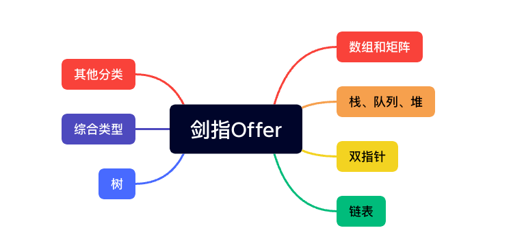

# 剑指Offer算法

> 总结整理，剑指Offer上笔刷的算法习题

## 算法题

### 数组和矩阵

- [x] [【简单】数组中重复的数字](数组和矩阵/duplicate.md)
- [x] [【简单】替换空格](数组和矩阵/replaceSpace.md)
- [x] [【简单】第一个只出现一次的字符位置](数组和矩阵/firstNotRepeatingChar.md)
- [x] [【中等】二维数组中的查找](数组和矩阵/find.md)
- [x] [【较难】顺时针打印矩阵](数组和矩阵/printMatrix.md)

### 栈、队列、堆

- [x] [【简单】两个栈实现队列](栈队列堆/stackToQueue.md)
- [x] [【中等】最小的k个数](栈队列堆/getLeastNumbers.md)
- [ ] [【中等】数据流中的中位数](栈队列堆/insertAndGetMedian.md)
- [ ] [【中等】栈的压入、弹出序列](栈队列堆/isPopOrder.md)
- [ ] [【中等】字符流中的第一个不重复的字符](栈队列堆/firstAppearingOnce.md)
- [ ] [【较难】滑动窗口的最大值](栈队列堆/maxInWindows.md)
- [ ] [【较难】包含min函数的栈](栈队列堆/getMinInJSStack.md)

### 双指针

- [x] [【中等】和为S的两个数字](双指针/findNumbersWithSum.md)
- [ ] [【中等】和为S的连续正数序列](双指针/findContinuousSequence.md)
- [ ] [【中等】左旋转字符串](双指针/leftRotateString.md)
- [ ] [【较难】翻转单词顺序列](双指针/reverseSentence.md)

### 链表

- [ ] [【简单】合并两个排序的链表](链表/merge.md)
- [ ] [【简单】两个链表的第一个公共结点](链表/findFirstCommonNode.md)
- [x] [【简单】从尾到头打印链表](链表/printListFromTailToHead.md)
- [ ] [【中等】链表中倒数第K个结点](链表/findKthToTail.md)
- [ ] [【中等】反转链表](链表/reverseList.md)
- [ ] [【中等】链表中环的入口结点](链表/entryNodeOfLoop.md)
- [ ] [【较难】删除链表中重复的结点](链表/deleteDuplication.md)
- [ ] [【较难】复杂链表的复制](链表/clone.md)

### 树

- [ ] [【简单】从上往下打印二叉树](树/printFromTopToBottom.md)
- [ ] [【简单】二叉树的镜像](树/mirror.md)
- [ ] [【简单】二叉树的深度](树/treeDepth.md)
- [ ] [【简单】判断是不是平衡二叉树](树/isBalancedTree.md)
- [ ] [【中等】把二叉树打印成多行](树/print.md)
- [ ] [【中等】重建二叉树](树/reConstructBinaryTree.md)
- [ ] [【中等】二叉树的下一个结点](树/getNext.md)
- [ ] [【中等】二叉查找树的第K个结点](树/bstKNode.md)
- [ ] [【中等】二叉搜索树的后序遍历序列](树/verifySequenceOfBST.md)
- [ ] [【较难】树的子结构](树/hasSubtree.md)
- [ ] [【困难】对称的二叉树](树/isSymmetrical.md)
- [ ] [【简单】二叉树中和为某一值的路径(一)](树/hasPathSum.md)
- [ ] [【中等】二叉树中和为某一值的路径(二)](树/findPath.md)
- [ ] [【中等】二叉树中和为某一值的路径(三)](树/findPathSumThree.md)
- [ ] [【中等】二叉搜索树与双向链表](树/convert.md)
- [ ] [【较难】序列化二叉树](树/serializeTree.md)
- [ ] [【简单】二叉搜索树的最近公共祖先](树/lowestCommonAncestor.md)
- [ ] [【中等】在二叉树中找到两个节点的最近公共祖先](树/lowestCommonAncestorFromNode.md)

### 综合类型

#### 贪心思想

- [x] [【中等】剪绳子](贪心思想/cutRope.md)
- [ ] [【较难】剪绳子（进阶版）](贪心思想/cutRopePro.md)

#### 二分查找

- [ ] [【简单】旋转数组的最小数字](二分查找/minNumberInRotateArray.md)
- [ ] [【中等】数字在升序数组中出现的次数](二分查找/getNumberOfK.md)

#### 分治

- [ ] [【中等】数值的整数次方](分治/power.md)

#### 排列

- [ ] [【中等】调整数组顺序使奇数位于偶数前面](排列/reOrderArray.md)
- [ ] [【中等】数组中的逆序对](排列/inversePairs.md)
- [ ] [【较难】把数组排成最小的数](排列/printMinNumber.md)

#### 动态规划

- [x] [【入门】斐波那契数列](动态规划/fibonacci.md)
- [x] [【简单】跳台阶 要么跳一阶，要么跳两阶](动态规划/jumpFloor.md)
- [ ] [【简单】连续子数组的最大和](动态规划/findGreatestSumOfSubArray.md)
- [ ] [【简单】构建乘积数组](动态规划/multiply.md)
- [x] [【中等】变态跳台阶 找规律 可跳任意阶](动态规划/jumpFloorII.md)
- [ ] [【中等】矩形覆盖](动态规划/rectCover.md)
- [ ] [【较难】丑数](动态规划/getUglyNumber.md)

#### 数学问题

- [x] [【简单】数组中出现次数超过一半的数字](数学/moreThanHalfNum.md)
- [ ] [【中等】圆圈中最后剩下的数 约瑟夫问题](数学/lastRemaining.md)
- [x] [【中等】从1到n整数中1出现的次数](数学/numberOf1Between1AndN.md)

#### 位运算

- [ ] [【中等】二进制中1的个数](位运算/numberOf1.md)
- [x] [【中等】数组中只出现一次的两个数字](位运算/findNumsAppearOnce.md)

### 其他分类

- [x] [【简单】不用加减乘除做加法](其他相关/add.md)
- [ ] [【中等】扑克牌顺子](其他相关/isContinuous.md)
- [ ] [【较难】把字符串转换成整数](其他相关/strToInt.md)

## 参考资料

- 牛客网：<https://www.nowcoder.com/exam/oj/ta?tpId=13>
