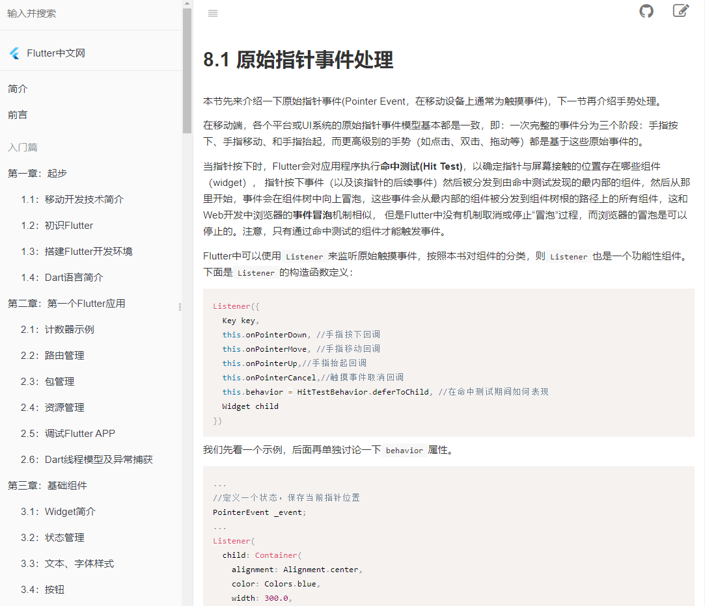
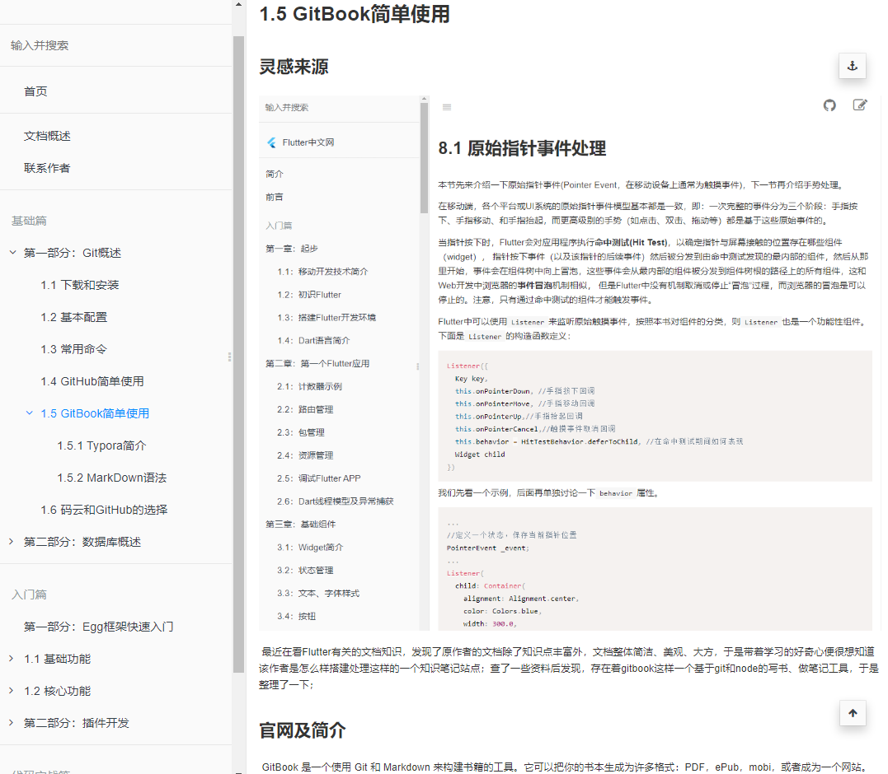

# 1.5 GitBook简单使用

## 灵感来源



​	最近在看Flutter有关的文档知识，发现了原作者的文档除了知识点丰富外，文档整体简洁、美观、大方，于是带着学习的好奇心便很想知道该作者是怎么样搭建处理这样的一个知识笔记站点；查了一些资料后发现，存在着gitbook这样一个基于git和node的写书、做笔记工具，于是整理了一下；

## 官网及简介

​	GitBook 是一个使用 Git 和 Markdown 来构建书籍的工具。它可以把你的书本生成为许多格式：PDF，ePub，mobi，或者成为一个网站。GitBook工具链是开源并且完全免费的，它的源码可以在 [GitHub](https://github.com/GitbookIO/gitbook) 上获取，也可以直接访问官网 [GitBook](https://www.gitbook.com/)进行学习、使用。


## 下载安装

### 1.安装NodeJs

​		直接在百度node进入官网，下载适合系统的安装包，安装过程是傻瓜式安装，直接点击下一步就行；

```bash
# 判断nodejs安装成功
$ node -v
# nodejs自带npm包安装
$ npm -v
```

### 2.安装Git

​		进入[git官网](https://git-scm.com/downloads)选择适合自己系统的git版本进行下载，下载后依然是进行傻瓜式的安装；


​		git配置及常用指令总结，[点击进入](http://www.142vip.cn:8090/archives/2019071521295140696)

### 3.全局安装

​		进入cmd终端，输入下面的命令来安装 GitBook。

```bash
$ npm install gitbook-cli -g
```

​		安装完成之后，你可以使用下面的命令来检验是否安装成功【注意V大写】。

```bash
$ gitbook -V
CLI version: 2.3.2
GitBook version: 3.2.3
```

## 创建图书

```bash
# 创建空白文件夹
$ mkdir test-gitbook
# 初始化文件夹，创建目录
$ gitbook init
```

​	在执行完创建指令后，并可以在文件夹中生成README.md和SUMMERY.md文件夹;执行`gitbook build`指令后会在书籍的文件夹中生成一个 `_book` 文件夹, 里面的内容即为生成的 html 文件，我们可以使用下面命令来生成网页而不开启服务器。


​		执行`gitbook serve`可以启动一个端口为400的本地服务器，相当于一个静态是web网站


​		直接访问`http://localhost:4000`就可以访问根据SUMMERY.md目录生成的静态资源网站，当然如果你有与服务器以及相对应的域名可以考虑利用gitbook来做笔记，并共享到自己的博客站点当中，也是很美妙的。



## 常用配置


具体的配置修改可以在book.json文件中进行修改，采用json数据的方式

## 常用命令

```bash
# 这里主要介绍一下 GitBook 的命令行工具 gitbook-cli 的一些命令, 首先说明两点:
# gitbook-cli 和 gitbook 是两个软件
# gitbook-cli 会将下载的 gitbook 的不同版本放到 ~/.gitbook中, 可以通过设置GITBOOK_DIR环境变量来指# 定另外的文件夹
# 列出gitbook所有的命令
$ gitbook help

# 输出gitbook-cli的帮助信息
$ gitbook --help

# 生成静态网页
$ gitbook build

# 生成静态网页并运行服务器
$ gitbook serve

# 生成时指定gitbook的版本, 本地没有会先下载
$ gitbook build --gitbook=2.0.1

# 列出本地所有的gitbook版本
$ gitbook ls

# 列出远程可用的gitbook版本
$ gitbook ls-remote

# 安装对应的gitbook版本
$ gitbook fetch 标签/版本号

# 更新到gitbook的最新版本
$ gitbook update

# 卸载对应的gitbook版本
$ gitbook uninstall 2.0.1

# 指定log的级别
$ gitbook build --log=debug

# 输出错误信息
$ gitbook builid --debug
```

## 常用插件

#### Search Plus

支持中文搜索, 需要将默认的 `search` 和 `lunr` 插件去掉。

[插件地址](https://plugins.gitbook.com/plugin/search-plus)

```
{
    "plugins": ["-lunr", "-search", "search-plus"]
}
```

#### Advanced Emoji

支持emoji表情

[emoij表情列表](http://www.emoji-cheat-sheet.com/)
[插件地址](https://plugins.gitbook.com/plugin/advanced-emoji)

```
"plugins": [
    "advanced-emoji"
]
```

使用示例：

 😄 😆 😊 😃 ☺️

#### Github

添加github图标

[插件地址](https://plugins.gitbook.com/plugin/github)

```
"plugins": [
    "github"
],
"pluginsConfig": {
    "github": {
        "url": "https://github.com/zhangjikai"
    }
}
```

#### Github Buttons

添加项目在 github 上的 star，watch，fork情况

[插件地址](https://plugins.gitbook.com/plugin/github-buttons)

```
{
    "plugins": [
        "github-buttons"
    ],
    "pluginsConfig": {
        "github-buttons": {
            "repo": "zhangjikai/gitbook-use",
            "types": [
                "star",
                "watch",
                "fork"
            ],
            "size": "small"
        }
    }
}
```

#### Splitter

使侧边栏的宽度可以自由调节

[插件地址](https://plugins.gitbook.com/plugin/splitter)

```
"plugins": [
    "splitter"
]
```

#### Sharing-plus

分享当前页面，比默认的 sharing 插件多了一些分享方式。

[插件地址](https://plugins.gitbook.com/plugin/sharing-plus)

```
 plugins: ["-sharing", "sharing-plus"]
```

配置:

```
"pluginsConfig": {
    "sharing": {
       "douban": false,
       "facebook": false,
       "google": true,
       "hatenaBookmark": false,
       "instapaper": false,
       "line": true,
       "linkedin": true,
       "messenger": false,
       "pocket": false,
       "qq": false,
       "qzone": true,
       "stumbleupon": false,
       "twitter": false,
       "viber": false,
       "vk": false,
       "weibo": true,
       "whatsapp": false,
       "all": [
           "facebook", "google", "twitter",
           "weibo", "instapaper", "linkedin",
           "pocket", "stumbleupon"
       ]
   }
}
```

#### Tbfed-pagefooter

为页面添加页脚

[插件地址](https://plugins.gitbook.com/plugin/tbfed-pagefooter)

```
"plugins": [
   "tbfed-pagefooter"
],
"pluginsConfig": {
    "tbfed-pagefooter": {
        "copyright":"Copyright &copy zhangjikai.com 2017",
        "modify_label": "该文件修订时间：",
        "modify_format": "YYYY-MM-DD HH:mm:ss"
    }
}
```

#### Expandable-chapters-small

使左侧的章节目录可以折叠

[插件地址](https://plugins.gitbook.com/plugin/expandable-chapters-small)

```
plugins: ["expandable-chapters-small"]
```

#### Toggle-chapters

使左侧的章节目录可以折叠。相比expandable-chapters， 没有折叠箭头符号，并且当前只有一项可以展开。参考：https://blog.csdn.net/lintcgirl/article/details/54314113

[插件地址](https://plugins.gitbook.com/plugin/toggle-chapters)

```
plugins: ["toggle-chapters"]
```

#### GA

Google 统计
[插件地址](https://plugins.gitbook.com/plugin/ga)

```
"plugins": [
    "ga"
 ],
"pluginsConfig": {
    "ga": {
        "token": "UA-XXXX-Y"
    }
}
```

#### 3-ba

百度统计
[插件地址](https://plugins.gitbook.com/plugin/3-ba)

```
{
    "plugins": ["3-ba"],
    "pluginsConfig": {
        "3-ba": {
            "token": "xxxxxxxx"
        }
    }
}
```

#### Donate

打赏插件
[插件地址](https://plugins.gitbook.com/plugin/donate)

```
"plugins": [
    "donate"
],
"pluginsConfig": {
    "donate": {
        "wechat": "https://zhangjikai.com/resource/weixin.png",
        "alipay": "https://zhangjikai.com/resource/alipay.png",
        "title": "",
        "button": "赏",
        "alipayText": "支付宝打赏",
        "wechatText": "微信打赏"
    }
}
```

#### Local Video

使用Video.js 播放本地视频
[插件地址](https://plugins.gitbook.com/plugin/local-video)

```
"plugins": [ "local-video" ]
```

使用示例：为了使视频可以自适应，我们指定视频的`width`为100%，并设置宽高比为`16:9`，如下面所示

```

<video id="my-video" class="video-js" controls preload="auto" width="100%"
poster="https://zhangjikai.com/resource/poster.jpg" data-setup='{"aspectRatio":"16:9"}'>
  <source src="https://zhangjikai.com/resource/demo.mp4" type='video/mp4' >
  <p class="vjs-no-js">
    To view this video please enable JavaScript, and consider upgrading to a web browser that
    <a href="http://videojs.com/html5-video-support/" target="_blank">supports HTML5 video</a>
  </p>
</video>

```

另外我们还要再配置下css，即在website.css中加入

```
.video-js {
    width:100%;
    height: 100%;
}
```




自动生成本页的目录结构。另外 GitBook 在处理重复的标题时有些问题，所以尽量不适用重复的标题。 [插件地址](https://plugins.gitbook.com/plugin/simple-page-toc)

```
{
    "plugins" : [
        "simple-page-toc"
    ],
    "pluginsConfig": {
        "simple-page-toc": {
            "maxDepth": 3,
            "skipFirstH1": true
        }
    }
}
```

使用方法: 在需要生成目录的地方加上 <!-- toc -->

#### Edit Link

如果将 GitBook 的源文件保存到github或者其他的仓库上，使用该插件可以链接到当前页的源文件上。
[插件地址](https://plugins.gitbook.com/plugin/edit-link)

```
"plugins": ["edit-link"],
"pluginsConfig": {
    "edit-link": {
        "base": "https://github.com/USER/REPO/edit/BRANCH",
        "label": "Edit This Page"
    }
}
```

#### Favicon

更改网站的 favicon.ico
[插件地址](https://plugins.gitbook.com/plugin/favicon)

```
{
    "plugins": [
        "favicon"
    ],
    "pluginsConfig": {
        "favicon": {
            "shortcut": "assets/images/favicon.ico",
            "bookmark": "assets/images/favicon.ico",
            "appleTouch": "assets/images/apple-touch-icon.png",
            "appleTouchMore": {
                "120x120": "assets/images/apple-touch-icon-120x120.png",
                "180x180": "assets/images/apple-touch-icon-180x180.png"
            }
        }
    }
}
```

#### Todo

添加 Todo 功能。默认的 checkbox 会向右偏移 2em，如果不希望偏移，可以在 `website.css` 里加上下面的代码:

```
input[type=checkbox]{
    margin-left: -2em;
}
```

[插件地址](https://plugins.gitbook.com/plugin/todo)

```
"plugins": ["todo"]
```

使用示例：

-  write some articles
-  drink a cup of tea

#### Copy-code-button

为代码块添加复制的按钮。

[插件地址](https://plugins.gitbook.com/plugin/copy-code-button)

```
{
    "plugins": ["copy-code-button"]
}
```

#### Klipse

集成 Klipse (online code evaluator)

[插件地址](https://plugins.gitbook.com/plugin/klipse)
[Klipse](https://github.com/viebel/klipse)

```
{
    "plugins": ["klipse"]
}
```

klipse 目前支持下面的语言：

- javascript: evaluation is done with the javascript function eval and pretty printing of the result is done with pretty-format
- clojure[script]: evaluation is done with Self-Hosted Clojurescript
- ruby: evaluation is done with Opal
- C++: evaluation is done with JSCPP
- python: evaluation is done with Skulpt
- scheme: evaluation is done with BiwasScheme
- PHP: evaluation is done with Uniter
- BrainFuck
- JSX
- EcmaScript2017
- Google Charts: See Interactive Business Report with Google Charts.

下面是一个使用示例：

```
​```eval-python
print [x + 1 for x in range(10)]
​```
```

效果如下所示：

```
print [x + 1 for x in range(10)]
```

## book.json常用配置

```json
{
    "title": "Eggjs开发技术文档",
    "description": "好记性不如G笔记",
    "author": "Taylor",
    "output.name": "site",
    "language": "zh-hans",
    "gitbook": "3.2.3",
    "root": ".",
    "links": {
        "sidebar": {
            "首页": "http://www.142vip.cn"
        }
    },
    "plugins": [
        "code",
        "-lunr",
        "-search",
        "search-pro",
        "github",
        "splitter",
        "tbfed-pagefooter",
        "donate",
        "-sharing",
        "sharing-plus",
        "prism",
        "-highlight",
        "mermaid",
        "ancre-navigation",
        "chapter-fold",
        "hide-element",
        "insert-logo",
        "klipse"
    ],
    "pluginsConfig": {
        "insert-logo": {
            "url": "images/logo.png",
            "style": "background: none; max-height: 30px; min-height: 30px"
        },    
        "hide-element": {
            "elements": [".gitbook-link"]
        },
        "github": {
            "url": "https://github.com/lijiam"
        },
        "code": {
            "copyButtons": true
        },
        "tbfed-pagefooter": {
            "copyright": "Copyright © Taylor 2019",
            "modify_label": "本书发布时间：",
            "modify_format": "YYYY-MM-DD HH:mm:ss"
        },
        "donate": {
            "wechat": "./assets/wechat_like.jpg",
            "alipay": "./assets/wechat_like.jpg",
            "button": "赏",
            "alipayText": "支付宝打赏",
            "wechatText": "微信打赏"
        },
        "sharing": {
            "facebook": false,
            "twitter": false,
            "weibo": true,
            "qq": true,
            "all": [
                "douban",
                "google",
                "qzone",
                "linkedin"
            ]
        },
        "prism": {
            "css": [
                "prismjs/themes/prism-solarizedlight.css"
            ],
            "lang": {
                "flow": "typescript"
            }
        }
    }
}
```

