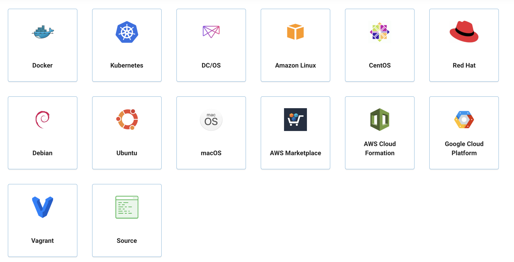

### 基本概念
Kong 是在客户端和（微）服务间转发API通信的API网关，通过插件扩展功能。Kong 有两个主要组件：

- Kong Server ：基于nginx的服务器，用来接收 API 请求。

- Apache Cassandra：用来存储操作数据。

可以通过增加更多 Kong Server 机器对 Kong 服务进行水平扩展，通过前置的负载均衡器向这些机器分发请求。根据文档描述，两个Cassandra节点就足以支撑绝大多数情况，但如果网络非常拥挤，可以考虑适当增加更多节点。

对于开源社区来说，Kong 中最诱人的一个特性是可以通过插件扩展已有功能，这些插件在 API 请求响应循环的生命周期中被执行。插件使用 Lua 编写，而且Kong还有如下几个基础功能：HTTP 基本认证、密钥认证、CORS（ Cross-origin Resource Sharing，跨域资源共享）、TCP、UDP、文件日志、API 请求限流、请求转发以及 nginx 监控。

Kong可运行在某些 Linux 发行版、Mac OS X 和 Docker 中，无论是本地机还是云端服务器皆可运行。

Kong是一个在Nginx运行的Lua应用程序，由lua-nginx-module实现。Kong和OpenResty一起打包发行，其中已经包含了lua-nginx-module。OpenResty不是Nginx的分支，而是一组扩展其功能的模块。

kong可以在多种环境下进行安装部署，官方对于不同的环境都有[说明](https://konghq.com/install/?itm_source=website&itm_medium=nav),支持的环境有：

#### 应用场景

简单来说，kong作为API网关，作用无非就是提供API路由服务；当然，kong通过一些组件、插件可以实现路由认证、路由管理，也能完成熔断、限流等操作。因此kong的应用场景非常丰富；功能强大的kong，目前我运用到的功能其实还是鲜少的，强大的功能就有待后续去学习了，先不展开了，可以看看官网...

最后，由于目前自己的网站项目部署都是基于docker的，所以后面会提供相应的docker部署方式.如果是集群不是，也会相应的总结一套docker-compose方式，进行文档说明.