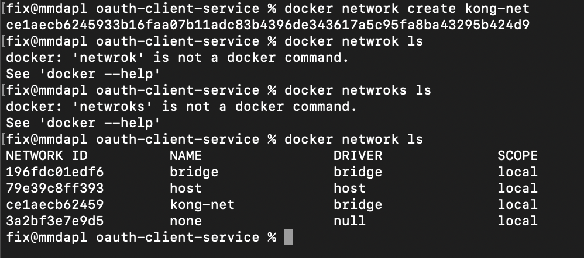
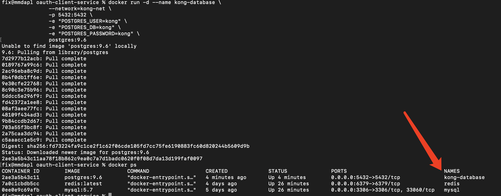
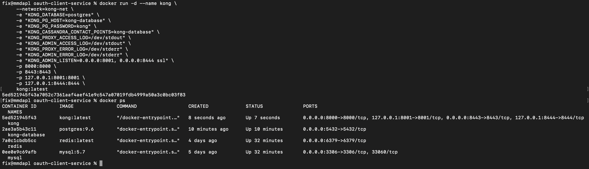
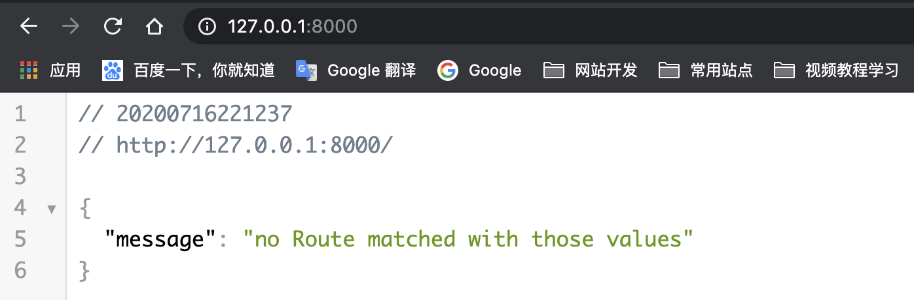
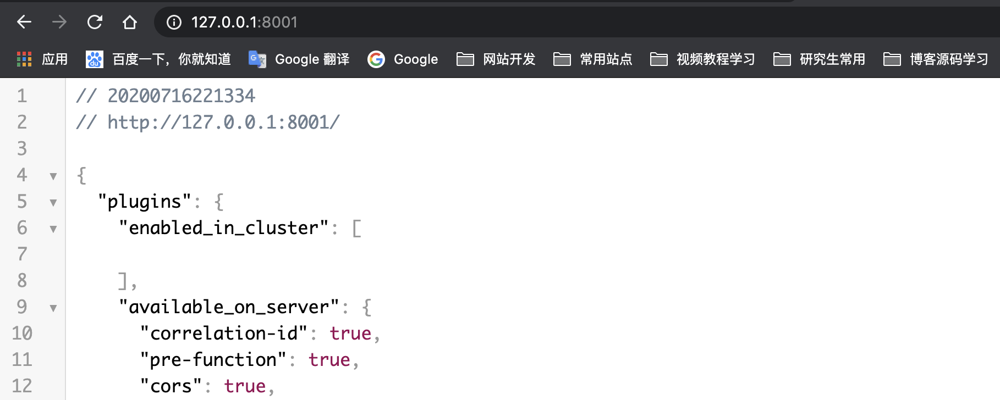

> 这篇文章将详细讲解docker下部署kong服务的过程，会涉及到一些docker操作，在阅读前默认已熟练docker的基础使用

### 安装说明

在前面已经有关于kong的简单介绍，kong的实质其实是基于nginx开发的网关，不过相比nginx反锁的配置，kong通过插件甚至可视化的图形界面管理，简化了网关搭建、使用的过程。并通过数据库的形式，对配置进行持久化保存，提高了整体效率。

如果你阅读过官网相关的说明，kong可以在多种环境下进行部署，本文将围绕docker展开

### 安装过程

#### 创建网络

这里提到的创建网络，实质是docker容器中网关的创建，docker有bridge、host等通信方式，先传经基本的bridge网络，实现docker容器间的数据通信、访问。

````bash
## 网络名称为kong-net
docker network create kong-net
## 查看网络
docker nerwork ls
````

实际效果：



#### 创建数据库

kong作为网关，需要保留相关的路由配置信息，因此需要用到数据库，目前官方支持Cassandra、PostgreSQL两种作为数据库，以此来构建容器服务，这里采用PostgreSQL构建kong-database容器，方便后续使用

```bash
## 构建kong-database
docker run -d --name kong-database \
               --network=kong-net \
               -p 5432:5432 \
               -e "POSTGRES_USER=kong" \
               -e "POSTGRES_DB=kong" \
               -e "POSTGRES_PASSWORD=kong" \
               postgres:9.6
## POSTGRES_USER 数据库用户名
## POSTGRES_PASSWORD 数据库密码
## POSTGRES_DB 初始数据库
```

从上面的docker命令可以看出，构建名为kong-database的数据库容器，暴露端口为5432，同时接入kong-net桥接网络里面（其实还可以指定ip）

实际效果：



#### 迁移数据库

在前面的kong-database中只是简单创建了名为kong的数据库，并没有对数据库里面的表进行很好的结构约束，因此可以用官方提供的docker指令，迁移数据库，定义好表的各种结构

```bash
## 数据库迁移
docker run --rm \
     --network=kong-net \
     -e "KONG_DATABASE=postgres" \
     -e "KONG_PG_HOST=kong-database" \
     -e "KONG_PG_PASSWORD=kong" \
     -e "KONG_CASSANDRA_CONTACT_POINTS=kong-database" \
     kong:latest kong migrations bootstrap
## KONG_DATABASE 迁移数据库名称
## KONG_PG_HOST 数据库容器名称
## KONG_PG_PASSWORD 数据库用户密码
```

需要注意的是，KONG_PG_HOST是需要要求kong-database容器和迁移容器在一个docker network网段内，此处可以使用容器名进行访问，完全是依赖docker网关，在统一个桥接网络下，实现容器互相访问

#### 部署kong

```bash
## 部署kong
docker run -d --name kong \
     --network=kong-net \
     -e "KONG_DATABASE=postgres" \
     -e "KONG_PG_HOST=kong-database" \
     -e "KONG_PG_PASSWORD=kong" \
     -e "KONG_CASSANDRA_CONTACT_POINTS=kong-database" \
     -e "KONG_PROXY_ACCESS_LOG=/dev/stdout" \
     -e "KONG_ADMIN_ACCESS_LOG=/dev/stdout" \
     -e "KONG_PROXY_ERROR_LOG=/dev/stderr" \
     -e "KONG_ADMIN_ERROR_LOG=/dev/stderr" \
     -e "KONG_ADMIN_LISTEN=0.0.0.0:8001, 0.0.0.0:8444 ssl" \
     -p 8000:8000 \
     -p 8443:8443 \
     -p 127.0.0.1:8001:8001 \
     -p 127.0.0.1:8444:8444 \
     kong:latest
## KONG_PG_HOST 数据库容器名称
```

上面的指令，需要暴露8000、8001、8443、8444四个端口，其中应用端口为8000和8443 ，分别代表着http和https请求；管理端口为8001和8444，也是分别支持http和https

实际效果：



### 检验kong

检验kong及对应的数据库是否安装成功，可以执行docker ps指令查看当前正在运行的容器，如果有确实且重启后依然没有效果，那么安装过程一定有问题，需要自己细心检查；

在保证容器正常运行的情况下，可以直接访问8000端口，查看相关效果；

http://you-ip:8000



因为目前没有进行路由设置，所以应用端也就没有匹配到路由；

http://you-ip:8001



访问管理端口时，可以看到有关kong的很多配置和插件，这里没有一一列举，自己可以好好尝试。至此，kong的简单部署操作也就告一段落。后续讲解有关konga的部署

