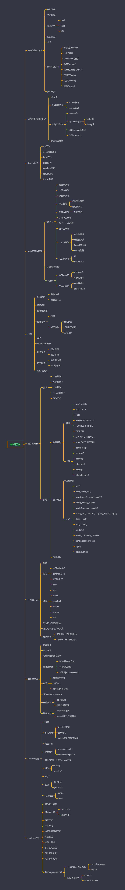

## 思维导图

>  内容同步与文档，可以结合思维导图对文档进行有效学习
>
> 创建时间：2020年5月16日

## 目录内容

### [语法与数据类型](javascript语法与数据结构.md)

- 基础了解

- 代码注释

- 变量声明

    - 声明

    - 求值

    - 提升

- 全局变量
- 常量
- 8种数据结构
    - 布尔值(boolean)
    - null关键字
    - undefined关键字
    - 数字(number)
    - 任意精度整数(bigint)
    - 字符串(string)
    - 代表(symbol)
    - 对象(object)
- 类型转换

### [流程控制与错误处理](javascript流程控制与错误处理.md)

- 语句块
- 条件判断语句
    - if...else语句
    - switch语句
- 异常处理语句
    - throw语句
    - try...catch语句
		- catch块
		- finally块
    - 嵌套try...catch语句
    - 使用Error对象
- Promise对象

### [循环与迭代](javascript循环与迭代.md)

- for语句
- do...while语句
- label语句
- break语句
- continue语句
- for...in语句
- for...of语句

### [表达式与运算符](javascript表达式和运算符.md)

- 运算符
    - 赋值运算符
    - 比较运算符
    - 算数运算符
    - 位运算符
    	- 位逻辑运算符
    	- 移位运算符
    - 逻辑运算符
    	- 短路求值
    - 字符串运算符
    - 条件(三元)运算符
    - 逗号运算符
    - 一元运算符
    - delete删除
    	- 删除数元素
    	- typeof操作符
    	- void运算符
    - 关系运算符
    	- in
    	- instanceof
- 运算符优先级
- 表达式
    - 基本表达式
    	- this关键字
    	- 分组操作符
    - 左值表达式
    	- new关键字
    	- super关键字

### [函数](javascript函数.md)

- 定义函数
    - 函数声明
    - 函数表达式
- 调用函数
- 函数作用域
- 函数堆栈
    - 递归
    - 嵌套函数
    	- 保存变量
    	- 多层嵌套函数
    	- 命名冲突
- 闭包
- arguments对象
- 函数参数
    - 默认参数
    - 剩余参数
- 箭头函数
    - 简介的函数
    - this的词法
- 预定义函数

### [数字和对象](javascript数字和日期.md)

- 数字
    - 二进制数字
    - 八进制数字
    - 十进制数字
    - 十六进制数字
    - 指数形式
- 对象
    - 数字对象
  - 属性
    - MAX_VALUE
    - MIN_VALUE
    - NaN
    - NEGATIVE_INFINITY
    - POSITIVE_INFINITY
    - EPSILON
    - MIN_SAFE_INTEGER
    - MAX_SAFE_INTEGER
  
  - 方法
    - parseFloat()
    - parseInt()
    - isFinite()
    - isInteger()
    - isNaN()
    - isSafeInteger()
- 数学对象
    - 基础使用
    - 方法
    - abs()
    - sin() , cos() , tan()
    - asin() ,acos() , atan() , atan2()
    - sinh() , cosh() , tanh()
    - asinh() , acosh() , atanh()
    - pow() ,exp() , expm1() , log10() ,log1p() , log2()
    - floor() , ceil()
    - min() , max()
    - random()
    - round() , fround() ,  trunc()
    - sqrt() , cbrt() , hypot()
    - sign()
    - clz32() , imul()
- 日期对象

### [正则表达式](javascript正则表达式.md)

- 创建
- 编写
    - 使用简单模式
    - 使用特殊字符
    - 使用插入语
- 使用
    - exec
    - test
    - match
    - matchAll
    - search
    - replace
    - split
- 括号的子字符串匹配
- 通过标志进行高级搜索
- 经典例子
- 改变输入字符串的顺序
- 用特殊字符串校验输入

### [对象的使用](javascript对象的使用.md)

- 简单概述
- 基本属性
- 枚举对象的所有属性
- 创建新对象
    - 使用对象初始化器
    - 使用构造函数
    - 使用Object.Create方法
- 继承
    - 对象属性索引
    - 定义方法
    - 通过this引用对象
- 定义getters与setters
- 删除属性
    - delete操作
    - 删除全局变量
- 比较对象
    - == 运算符相等
    - === 全等于 严格相等

### [Promise对象](promise对象的使用.md)

- 约定
- 链式调用
    - then()的使用
    - 回调地狱
    - catche的后续链式操作
- 错误传递
- 拒绝事件
    - rejectionhandled
    - unhandledrejection
- 旧版本API上创建Promise对象
- 组合
    - reject()
    - resolve()
- 时序
- 嵌套
    - 多个then
    - 多个catch
- 常见错误
    - async
    - await

### [modules模块](modules模块.md)

- 模块化的背景
- 浏览器支持
    - import导入
    - export导出
- 原始写法
- 对象写法
- 立即执行函数写法
- 放大模式
- 宽放大模式
- 输入全局变量
- 导出模块功能
- 导入模块功能
- 常用exports的区别
    - commonJs模块规范
- module.exports
- require
    - ES6模块规范
- exports
- exports default