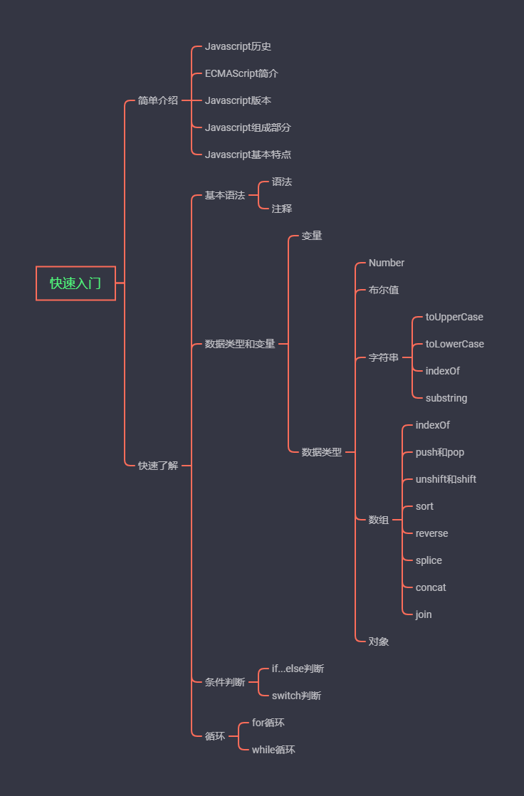

## 快速入门

### 简单介绍

  - Javascript历史
  - ECMAScript简介
  - Javascript版本
  - Javascript组成部分
  - Javascript基本特点

### 快速了解

- 基本语法
  - 语法
  - 注释
- 数据类型和变量
   - 变量
- 数据类型
   - Number
   - 布尔值
   - 字符串
      - toUpperCase
      - toLowerCase
      - indexOf
      - substring
      - 
    - 数组
          - indexOf
          - push和pop
          - unshift和shift
          - sort
          - reverse
          - splice
          - concat
          - join
     - 对象
- 条件判断
   - if...else判断
   - switch判断
- 循环
   - for循环
   - while循环