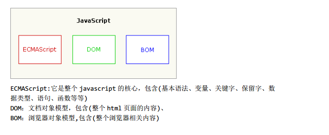

## 基础介绍

### JavaScript历史

要了解JavaScript，我们首先要回顾一下JavaScript的诞生。

在上个世纪的1995年，当时的网景公司正凭借其Navigator浏览器成为Web时代开启时最著名的第一代互联网公司。

由于网景公司希望能在静态HTML页面上添加一些动态效果，于是叫Brendan Eich这哥们在两周之内设计出了JavaScript语言。你没看错，这哥们只用了10天时间。

为什么起名叫JavaScript？原因是当时Java语言非常红火，所以网景公司希望借Java的名气来推广，但事实上JavaScript除了语法上有点像Java，其他部分基本上没啥关系。

### ECMAScript简介

因为网景开发了JavaScript，一年后微软又模仿JavaScript开发了JScript，为了让JavaScript成为全球标准，几个公司联合ECMA（European Computer Manufacturers Association）组织定制了JavaScript语言的标准，被称为ECMAScript标准。

所以简单说来就是，ECMAScript是一种语言标准，而JavaScript是网景公司对ECMAScript标准的一种实现。

那为什么不直接把JavaScript定为标准呢？因为JavaScript是网景的注册商标。

不过大多数时候，我们还是用JavaScript这个词。如果你遇到ECMAScript这个词，简单把它替换为JavaScript就行了。

### JavaScript版本

JavaScript语言是在10天时间内设计出来的，虽然语言的设计者水平非常NB，但谁也架不住“时间紧，任务重”，所以，JavaScript有很多设计缺陷，我们后面会慢慢讲到。

此外，由于JavaScript的标准——ECMAScript在不断发展，最新版ECMAScript 6标准（简称ES6）已经在2015年6月正式发布了，所以，讲到JavaScript的版本，实际上就是说它实现了ECMAScript标准的哪个版本。

由于浏览器在发布时就确定了JavaScript的版本，加上很多用户还在使用IE6这种古老的浏览器，这就导致你在写JavaScript的时候，要照顾一下老用户，不能一上来就用最新的ES6标准写，否则，老用户的浏览器是无法运行新版本的JavaScript代码的。

不过，JavaScript的核心语法并没有多大变化。我们的教程会先讲JavaScript最核心的用法，然后，针对ES6讲解新增特性。

| 版本  | 发布日期      | 基于                                                 | Netscape Navigator  | Mozilla Firefox | Internet Explorer                                            | Opera                          | Safari   | Google Chrome |
| :---- | :------------ | ---------------------------------------------------- | :------------------ | :-------------- | :----------------------------------------------------------- | :----------------------------- | :------- | :------------ |
| 1.0   | 1996年3月     |                                                      | 2.0                 |                 |                                                              |                                |          |               |
| 1.1   | 1996年8月     |                                                      | 3.0                 |                 | 3.0                                                          |                                |          |               |
| 1.2   | 1997年6月     |                                                      | 4.0-4.05            |                 |                                                              |                                |          |               |
| 1.3   | 1998年10月    | ECMA-262 1 edition / ECMA-262 2 edition              | 4.06-4.7x           |                 | 4.0                                                          |                                |          |               |
| 1.4   |               |                                                      | Netscape 　　Server |                 |                                                              |                                |          |               |
| 1.5   | 2000年11月    | ECMA-262 3 edition                                   | 6.0                 | 1.0             | 5.5 (JScript 5.5), 　　6 (JScript 5.6), 　　7 (JScript 5.7), 　　8 (JScript 6) | 6.0, 　　7.0, 　　8.0, 　　9.0 |          |               |
| 1.6   | 2005年11月    | 1.5 + Array extras + Array and String generics + E4X |                     | 1.5             |                                                              |                                | 3.0, 3.1 |               |
| 1.7   | 2006年10月    | 1.6 + Pythonic generators + Iterators + let          |                     | 2.0             |                                                              |                                | 3.2, 4.0 | 1.0           |
| 1.8   | 2008年6月     | 1.7 + Generator expressions + Expression closures    |                     | 3.0             |                                                              | 11.50                          |          |               |
| 1.8.1 |               | 1.8 + Native JSON support + Minor Updates            |                     | 3.5             |                                                              |                                |          |               |
| 1.8.2 | 2009年6月22日 | 1.8.1 + Minor updates                                |                     | 3.6             |                                                              |                                |          |               |
| 1.8.5 | 2010年7月27日 | 1.8.1 + ECMAScript 5 Compliance                      |                     | 4               | 9                                                            | 11.60                          |          |               |

| 版本    | 说明                                                         | 实现                                |
| :------ | :----------------------------------------------------------- | :---------------------------------- |
| ECMA v1 | 标准化了JavaScript1.1的基本特性，并添加了一些新特性。没有标准化switch语句和正则表达式。 | 由Netscape 4.5和IE 4实现。          |
| ECMA v2 | ECMA v1的维护版本，只添加了说明                              | 由Netscape 4.5和IE 4实现。          |
| ECMA v3 | 标准化了switch语句、异常处理和正则表达式。                   | 由Mozilla、Netscape 6和IE 5.5实现。 |

### JavaScript组成部分

### JavaScript基本特点

JavaScript是一种属于网络的高级脚本语言,已经被广泛用于Web应用开发,常用来为网页添加各式各样的动态功能,为用户提供更流畅美观的浏览效果。通常JavaScript脚本是通过嵌入在HTML中来实现自身的功能的。

- [脚本语言](https://baike.baidu.com/item/脚本语言)。JavaScript是一种解释型的脚本语言,C、[C++](https://baike.baidu.com/item/C%2B%2B)等语言先[编译](https://baike.baidu.com/item/编译)后执行,而JavaScript是在程序的运行过程中逐行进行解释。

- 基于对象。JavaScript是一种基于对象的脚本语言,它不仅可以创建对象,也能使用现有的对象。
- 简单。JavaScript语言中采用的是弱类型的变量类型,对使用的数据类型未做出严格的要求,是基于Java基本语句和控制的脚本语言,其设计简单紧凑。
- 动态性。JavaScript是一种采用事件驱动的脚本语言,它不需要经过Web服务器就可以对用户的输入做出响应。在访问一个网页时,鼠标在网页中进行鼠标点击或上下移、窗口移动等操作JavaScript都可直接对这些事件给出相应的响应。
- 跨平台性。JavaScript脚本语言不依赖于操作系统,仅需要浏览器的支持。因此一个JavaScript脚本在编写后可以带到任意机器上使用,前提上机器上的浏览器支 持JavaScript脚本语言,JavaScript已被大多数的浏览器所支持。

不同于服务器端脚本语言，例如[PHP](https://baike.baidu.com/item/PHP/9337)与[ASP](https://baike.baidu.com/item/ASP/128906)，JavaScript主要被作为客户端脚本语言在用户的浏览器上运行，不需要服务器的支持。所以在早期程序员比较青睐于JavaScript以减少对服务器的负担，而与此同时也带来另一个问题：安全性。

而随着服务器的强壮，虽然程序员更喜欢运行于服务端的脚本以保证安全，但JavaScript仍然以其跨平台、容易上手等优势大行其道。同时，有些特殊功能（如[AJAX](https://baike.baidu.com/item/AJAX/8425)）必须依赖Javascript在客户端进行支持。随着引擎如V8和框架如[Node.js](https://baike.baidu.com/item/Node.js)的发展，及其事件驱动及[异步IO](https://baike.baidu.com/item/异步IO)等特性，JavaScript逐渐被用来编写服务器端程序。