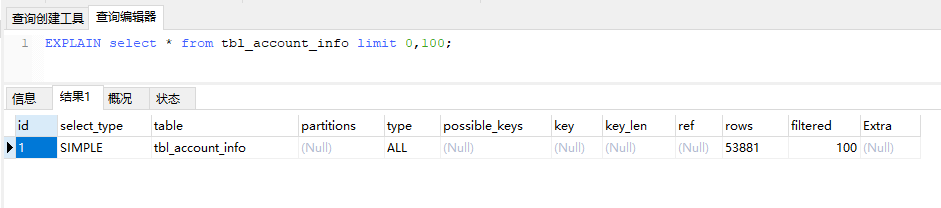

## MySQL优化之Explain

> MySQL中有专门负责优化SELECT语句的优化器模块，主要功能，通过计算分析系统中收集到统计信息，为客户端请求的Query提供他认为最优的执行计划（他认为最优的数据检索方式，但不见得DBA认为是最优的，这部分最耗费时间）。
>
> 当客户端向MySQL请求一条Query，命令解析器模块完成请求分类，区别出是SELECT并转发给MySQL Query Optimize时，MySQL Query Optimize首先会对整条Query进行优化，处理条一些常量表达式的预算，直接换算成常量值，并对Query中的查询条件进行简化和转换，如去掉一些无用或显而易见的条件、结构调整等。然后分析Query中的Hint信息（如果有），看显示Hint信息是否可以完全确定该Query的执行计划，如果没有Hint或Hint信息还不足以完全确定执行计划，则会读取锁涉及对象的统计信息，根据Query进行写相应的计算分析，然后再得出最后的执行计划。

### explain的作用

- 可以查看表的读取顺序；

- 可以查看数据读取操作的操作类型；

-  可以查看哪些索引可以使用；

- 可以查看哪些索引被实际使用；

- 可以查看表与表之间的引用关系；

- 可以查看每张表有多少行记录被优化器查询。

### explain的用法

explain + SQL语句

```mysql
## 查询前100条
EXPLAIN SELECT * FROM tbl_account_info LIMIT 0,100;
```

执行效果：



### explain字段的解释

#### id

select识别符。这个是select查询序列号。这个不重要,查询序号即为sql语句执行的顺序。

#### select_type

- **simple** 它表示简单的select,没有union和子查询
- **primary** 最外面的select,在有子查询的语句中，最外面的select查询就是primary
- **union** union语句的第二个或者说是后面那一个.
- **dependent union**    UNION中的第二个或后面的SELECT语句，取决于外面的查询
- **union result**        UNION的结果

#### table

输出的行所用的表

#### type

显示连接使用了何种类型。从最好到最差的连接类型为const、eq_reg、ref、range、indexhe和all

- **const**    表最多有一个匹配行，const用于比较primary key 或者unique索引。因为只匹配一行数据，所以很快记住一定是用到primary key 或者unique
- **eq_reg**:   mysql手册是这样说的:"对于每个来自于前面的表的行组合，从该表中读取一行。这可能是最好的联接类型，除了const类型。它用在一个索引的所有部分被联接使用并且索引是UNIQUE或PRIMARY KEY"。eq_ref可以用于使用=比较带索引的列。
- **ref**  ref 对于每个来自于前面的表的行组合，所有有匹配索引值的行将从这张表中读取。如果联接只使用键的最左边的前缀，或如果键不是UNIQUE或PRIMARY KEY（换句话说，如果联接不能基于关键字选择单个行的话），则使用ref。如果使用的键仅仅匹配少量行，该联接类型是不错的。
- **range**   给定范围内的检索，使用一个索引来检查行。
- **index**    该联接类型与ALL相同，除了只有索引树被扫描。这通常比ALL快，因为索引文件通常比数据文件小。（也就是说虽然all和Index都是读全表，但index是从索引中读取的，而all是从硬盘中读的）
- **ALL** 对于每个来自于先前的表的行组合，进行完整的表扫描。如果表是第一个没标记const的表，这通常不好，并且通常在它情况下**很**差。通常可以增加更多的索引而不要使用ALL，使得行能基于前面的表中的常数值或列值被检索出。

#### possible_keys

显示可能应用在这张表中的索引。如果为空，没有可能的索引。可以为相关的域从where语句中选择一个合适的语句

#### key

实际使用的索引。如果为null，则没有使用索引。很少的情况下，mysql会选择优化不足的索引。这种情况下，可以在select语句中使用use index（indexname）来强制使用一个索引或者用ignore index（indexname）来强制mysql忽略索引

#### key_len

使用的索引的长度。在不损失精确性的情况下，**长度越短越好**

#### ref

显示索引的哪一列被使用了，如果可能的话，是一个常数

#### rows

mysql认为必须检查的用来返回请求数据的行数,**数值越大越不好**，说明没有用好索引

#### extra

关于mysql如何解析查询的额外信息。using temporary和using filesort是**最差的情况**，意思mysql根本不能使用索引，结果是检索会很慢

- **distinct**   一旦mysql找到了与行相联合匹配的行，就不再搜索了

- **not exists**   mysql优化了left join，一旦它找到了匹配left join标准的行，就不再搜索了

- **range checked for each record（index map:#）** **没有找到理想的索引，因此对于从前面表中来的每一个行组合，mysql检查使用哪个索引，并用它来从表中返回行。这是使用索引的最慢的连接之一**

- **using filesort**  **看到这个的时候，查询就需要优化了**。mysql需要进行额外的步骤来发现如何对返回的行排序。它根据连接类型以及存储排序键值和匹配条件的全部行的行指针来排序全部行

- **using index**    列数据是从仅仅使用了索引中的信息而没有读取实际的行动的表返回的，这发生在对表的全部的请求列都是同一个索引的部分的时候

- **using temporary**   **看到这个的时候，查询需要优化了**。这里，mysql需要创建一个临时表来存储结果，这通常发生在对不同的列集进行order by上，而不是group by上

- **where used** 使用了where从句来限制哪些行将与下一张表匹配或者是返回给用户。如果不想返回表中的全部行，并且连接类型all或index，这就会发生，或者是查询有问题不同连接类型的解释（按照效率高低的顺序排序）

- **system**  表只有一行：system表。这是const连接类型的特殊情况

- **const**   表中的一个记录的最大值能够匹配这个查询（索引可以是主键或惟一索引）。因为只有一行，这个值实际就是常数，因为mysql先读这个值然后把它当做常数来对待

- **eq_ref**   在连接中，mysql在查询时，从前面的表中，对每一个记录的联合都从表中读取一个记录，它在查询使用了索引为主键或惟一键的全部时使用

- **ref**   这个连接类型只有在查询使用了不是惟一或主键的键或者是这些类型的部分（比如，利用最左边前缀）时发生。对于之前的表的每一个行联合，全部记录都将从表中读出。这个类型严重依赖于根据索引匹配的记录多少—越少越好

- **range**   这个连接类型使用索引返回一个范围中的行，比如使用>或<查找东西时发生的情况

- **index**    这个连接类型对前面的表中的每一个记录联合进行完全扫描（比all更好，因为索引一般小于表数据）

- **all**   这个连接类型对于前面的每一个记录联合进行完全扫描，这一般比较糟糕，应该尽量避免