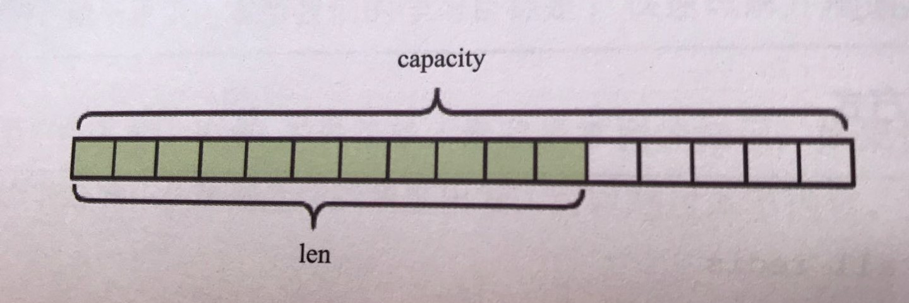
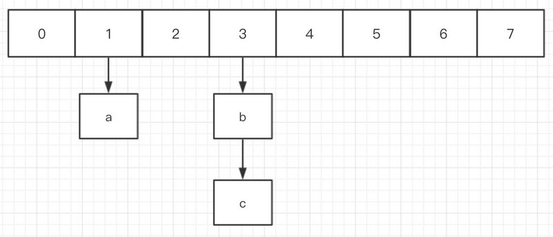
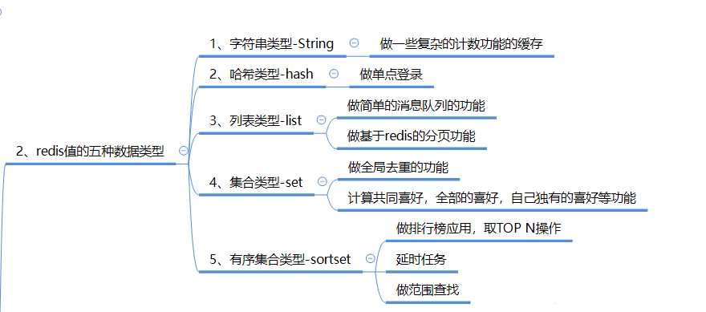

# Redis简介
>Redis是一个开源的、基于内存的数据结构存储器，可以用作数据库、缓存和消息中间件。

## NoSQL

Redis和MongoDB是当前使用最广泛的NoSQL，而就Redis技术而言，它的性能十分优越，可以支持每秒十几万此的读/写操作，其性能远超数据库，并且还支持集群、分布式、主从同步等配置，原则上可以无限扩展，让更多的数据存储在内存中，更让人欣慰的是它还支持一定的事务能力，这保证了高并发的场景下数据的安全和一致性。

## C/S架构

可以通过Redis的命令行，当然也可以通过各种语言的Redis API，在代码里面对Hash表进行操作，这些都是Redis客户端（Client）,而这些命令都是发送给Redis服务端（Server），**也就是说Redis其实是一个C/S架构。**

Redis的Server是单线程服务器，基于Event-Loop模式来处理Client的请求，这一点和NodeJS很相似。使用单线程的好处包括：
* 不必考虑线程安全问题。很多操作都不必加锁，既简化了开发，又提高了性能；

* 减少线程切换损耗的时间。线程一多，CPU在线程之间切来切去是非常耗时的，单线程服务器则没有了这个烦恼；

## 五种数据结构

### string
最常用最简单的数据结构 

最常用的就是我们将数据库数据序列化成字符串，然后将序列化后的字符串塞进Redis来进行缓存，取数据的时候再反序列化一次。

Redis的字符串是动态字符串，是可以修改的字符串，内部结构的实现类似于ArrayList，采用预分配冗余的方式来减少内存的平反使用，内部为当前字符串分配到实际空间capacity一般是大于字符串的长度len，len<1MB时，加倍扩容，len>1MB,每次扩容1MB， len的max为512MB.
  

###  list

Rediso的list是一个链表而不是数组，这意味着list的插入和删除速度非常快，时间复杂度为O(1),但是索引定位很慢，时间复杂度为O(n).

Redis的列表结构常用来做异步队列处理，将需要延后处理的任务序列化成字符串，塞进Redis的列表，另一个线程从这个表种轮询数据进行处理。

**快速列表**

如果再深入一点，你会发现Redis底层存储的还不是一个简单的linkedlist，而是称之为快速链表quicklist的一个结构。首先在列表元素较少的情况下会使用一块连续的内存存储，这个结构是ziplist，也即是压缩列表。它将所有的元素紧挨着一起存储，分配的是一块连续的内存。当数据量比较多的时候才会改成quicklist。因为普通的链表需要的附加指针空间太大，会比较浪费空间。比如这个列表里存的只是int类型的数据，结构上还需要两个额外的指针prev和next。所以Redis将链表和ziplist结合起来组成了quicklist。也就是将多个ziplist使用双向指针串起来使用。这样既满足了快速的插入删除性能，又不会出现太大的空间冗余。

### hash
Redis的字典相当于Java里面的HashMap，它是无序字典，内部存储了很多键值对，实现结构时“数组+链表”

**内部原理**

hash 的内部结构.第一维是数组,第二维是链表.组成一个 hashtable.
 

在 Java 中 HashMap 扩容是个很耗时的操作,需要去申请新的数组,为了追求高性能,Redis 采用了渐进式 rehash 策略.这也是 hash 中最重要的部分.

**渐进式 rehash**

在 hash 的内部包含了两个hashtable,一般情况下只是用一个.在扩容的时候 rehash 策略会保留新旧两个 hashtable 结构,查询时也会同时查询两个 hashtable.Redis会将旧 hashtable 中的内容一点一点的迁移到新的 hashtable 中,当迁移完成时,就会用新的 hashtable 取代之前的.当 hashtable 移除了最后一个元素之后,这个数据结构将会被删除.

正常情况下,当 hashtable 中元素的个数等于数组的长度时,就会开始扩容,扩容的新数组是原数组大小的 2 倍.如果 Redis 正在做 bgsave(持久化) 时,可能不会去扩容,因为要减少内存页的过多分离(Copy On Write).但是如果 hashtable 已经非常满了,元素的个数达到了数组长度的 5 倍时,Redis 会强制扩容.

当hashtable 中元素逐渐变少时,Redis 会进行缩容来减少空间占用,并且缩容不会受 bgsave 的影响,缩容条件是元素个数少于数组长度的 10%.

### set
Redis的集合相当于HashSet，内部的键值对时无序的，唯一的，他的内部实现相当于一个特殊字典，字典中所有的balue都是一个值NULL.

当即和中最后一个元素被移除后，数据结构自动删除，内存被回收.

**set结构有去重功能**

### zset
一方面他是一个set，保证了内部 value 的唯一性，另一方面它可以给每个 value 赋予一个 score，代表这个 value 的排序权重。它的内部实现用的是一种叫做 “跳跃列表” 的数据结构。

**zset 中的最后一个 value 被移除后，数据类型被自动删除，内存被回收。**

**使用案例**

zset 可以用来存储粉丝列表，value 值是粉丝的用户 ID，score 是关注时间。我们可以对粉丝列表按关注时间进行排序。

zset 还可以用来存储学生的成绩，value 值是学生的 ID，score 是他的考试成绩。我们对成绩按分数进行排序就可以得到他的名次

## 多机数据库方案

redis的多机数据库实现，主要分为以下三种：
* Redis哨兵（Sentinel）
* Redis复制（主从）
* Redis集群  
### Redis复制（主从）
* 一个master可以拥有多个slave，一个slave又可以拥有多个slave。形成了强大的多级服务器集群架构。
* master用写数据，经统计网站的读写比率是10：1
* 通过主从分离可以实现读写分离
#### 主从模式的必要性
* 主从模式的一个作用是备份数据，这样当一个节点损坏（指不可恢复的硬件损坏）时，数据因为有备份，可以方便恢复。

* 另一个作用是负载均衡，所有客户端都访问一个节点肯定会影响Redis工作效率，有了主从以后，查询操作就可以通过查询从节点来完成。

#### 主从模式的理解
* 一个Master可以有多个Slaves,默认配置下，master节点可以进行读和写，slave节点只能进行读操作，写操作被禁止。

* 不要修改配置让slave节点支持写操作，没有意义，原因一，写入的数据不会被同步到其他节点；原因二，当master节点修改同一条数据后，slave节点的数据会被覆盖掉。
* slave节点挂了不影响其他slave节点的读和master节点的读和写，重新启动后会将数据master节点同步过来。
* master节点挂了以后，不影响slave节点的读，Redis将不再提供写服务，master节点启动后Redis将重新对外提供写服务。
* 当master节点设置密码时：客户端访问master需要密码，启动slave需要密码，在配置中进行配置即可，客户端访问slave不需要密码。

#### 主从模式的缺点
* Redis在主从模式下，必须保证主节点不会宕机——一旦主节点宕机，其它节点不会竞争称为主节点，此时，Redis将丧失写的能力。这点在生产环境中，是致命的。

### Redis哨兵（Sentinel）
>  基于主从模式做的一定变化，它能够为Redis提供了高可用性。在实际生产中，服务器难免不会遇到一些突发状况：服务器宕机，停电，硬件损坏等。这些情况一旦发生，其后果往往是不可估量的。而哨兵模式在一定程度上能够帮我们规避掉这些意外导致的灾难性后果。其实，哨兵模式的核心还是主从复制。只不过相对于主从模式在主节点宕机导致不可写的情况下，多了一个竞选机制——从所有的从节点竞选出新的主节点。竞选机制的实现，是依赖于在系统中启动一个sentinel进程。

#### 特点

1. 监控：它会监听主服务器和从服务器之间是否在正常工作。

2. 通知：它能够通过API告诉系统管理员或者程序，集群中某个实例出了问题。

3. 故障转移：它在主节点出了问题的情况下，会在所有的从节点中竞选出一个节点，并将其作为新的主节点。

4. 提供主服务器地址：它还能够向使用者提供当前主节点的地址。这在故障转移后，使用者不用做任何修改就可以知道当前主节点地址。

### Redis集群（cluster）
* Redis 集群是一个提供在多个Redis间节点间共享数据的程序集。

* Redis集群并不支持处理多个keys的命令,因为这需要在不同的节点间移动数据,从而达不到像Redis那样的性能,在高负载的情况下可能会导致不可预料的错误.

* Redis 集群通过分区来提供一定程度的可用性,在实际环境中当某个节点宕机或者不可达的情况下继续处理命令. Redis 集群的优势:

    - 自动分割数据到不同的节点上。
    - 整个集群的部分节点失败或者不可达的情况下能够继续处理命令。

#### Redis 集群的数据分片

Redis 集群有16384个哈希槽,每个key通过CRC16校验后对16384取模来决定放置哪个槽.集群的每个节点负责一部分hash槽,比如当前集群有3个节点,那么:

节点 A 包含 0 到 5500号哈希槽.
节点 B 包含5501 到 11000 号哈希槽.
节点 C 包含11001 到 16384号哈希槽.

**这种结构很容易添加或者删除节点.** 比如如果我想新添加个节点D, 我需要从节点 A, B, C中得部分槽到D上. 如果我想移除节点A,需要将A中的槽移到B和C节点上,然后将没有任何槽的A节点从集群中移除即可. 由于从一个节点将哈希槽移动到另一个节点并不会停止服务,所以无论添加删除或者改变某个节点的哈希槽的数量都不会造成集群不可用的状态.

**redis cluster是一个去中心化的集群，每个节点都会跟其他节点保持连接，用来交换彼此的信息**

#### 故障转移

为了使得集群在一部分节点下线或者无法与集群的大多数（majority）节点进行通讯的情况下， 仍然可以正常运作， Redis 集群对节点使用了主从复制功能： 集群中的每个节点都有 1 个至 N 个复制品（replica）， 其中一个复制品为主节点（master）， 而其余的 N-1 个复制品为从节点（slave）。

集群间节点支持主从关系，复制的逻辑基本复用了单机版的实现。不过还是有些地方需要注意:
* 首先集群间节点建立主从关系不再使用原有的SLAVEOF命令和SLAVEOF配置，而是通过cluster replicate命令，这保证了主从节点需要先完成握手，才能建立主从关系。
* 集群是不能组成链式主从关系的，也就是说从节点不能有自己的从节点。不过对于集群外的没开启集群功能的节点，redis并不干预这些节点去复制集群内的节点，但是在集群故障转移时，这些集群外的节点，集群不会处理。
* 集群内节点想要复制另一个节点，需要保证本节点不再负责任何slot，不然redis也是不允许的。

* 集群内的从节点在与其他节点通信的时候，传递的消息中数据分布表和epoch是master的值。

## Redis缓存
### 缓存雪崩:
由于原有缓存失效，新缓存未到期间
(例如：我们设置缓存时采用了相同的过期时间，在同一时刻出现大面积的缓存过期)，所有原本应该访问缓存的请求都去查询数据库了，而对数据库CPU和内存造成巨大压力，严重的会造成数据库宕机。从而形成一系列连锁反应，造成整个系统崩溃。  

**解决方法**：  

**大多数系统设计者考虑用加锁（ 最多的解决方案）**或者队列的方式保证来不会有大量的线程对数据库一次性进行读写，从而避免失效时大量的并发请求落到底层存储系统上。还有一个简单方案就是将缓存失效时间分散开。

### 缓存穿透:
缓存穿透是指缓存和数据库中都没有的数据，而用户不断发起请求，如发起为id为“-1”的数据或id为特别大不存在的数据。这时的用户很可能是攻击者，攻击会导致数据库压力过大。

解决方法：  

- 布隆过滤器:将所有可能存在的数据哈希到一个足够大的bitmap中，一个一定不存在的数据会被 这个bitmap拦截掉，从而避免了对底层存储系统的查询压力。
- 简单粗暴的方法：如果一个查询返回的数据为空（不管是数据不存在，还是系统故障），我们仍然把这个空结果进行缓存，但它的过期时间会很短，最长不超过五分钟。

### 缓存预热
缓存预热就是系统上线后，将相关的缓存数据直接加载到缓存系统。这样就可以避免在用户请求的时候，先查询数据库，然后再将数据缓存的问题，用户直接查询事先被预热的缓存数据。

**解决思路**

- 直接写个缓存刷新页面，上线时手工操作下；
- 数据量不大，可以在项目启动的时候自动进行加载；
- 定时刷新缓存；

### 缓存更新
除了缓存服务器自带的缓存失效策略之外（Redis默认的有6中策略可供选择），我们还可以根据具体的业务需求进行自定义的缓存淘汰，常见的策略有两种：
* 定时去清理过期的缓存；
* 当有用户请求过来时，再判断这个请求所用到的缓存是否过期，过期的话就去底层系统得到新数据并更新缓存。
两者各有优劣，第一种的缺点是维护大量缓存的key是比较麻烦的，第二种的缺点就是每次用户请求过来都要判断缓存失效，逻辑相对比较复杂。

### Memcache与Redis
* 存储方式 Memecache把数据全部存在内存之中，断电后会挂掉，数据不能超过内存大小。 Redis有部份存在硬盘上，redis可以持久化其数据
* 数据支持类型 memcached所有的值均是简单的字符串，redis支持更为丰富的数据类型 ，提供list，set，zset，hash等数据结构的存储
* 使用底层模型不同 它们之间底层实现方式 以及与客户端之间通信的应用协议不一样。 Redis直接自己构建了VM 机制 ，因为一般的系统调用系统函数的话，会浪费一定的时间去移动和请求。
* value 值大小不同：Redis 最大可以达到 1gb；memcache 只有 1mb。
* redis的速度比memcached快很多
* **Redis支持数据的备份，即master-slave模式的数据备份**。

## Redis还可以

## 参考资料
* [Redis简明教程](https://zhuanlan.zhihu.com/p/37055648)

* [Redis的三种模式：主从、哨兵、集群](http://www.pianshen.com/article/1023276171/)
* [Redis相关的知识](https://blog.csdn.net/Butterfly_resting/article/details/89668661)
* [Redis除了做缓存--Redis做消息队列/Redis做分布式锁/Redis做接口限流](https://www.cnblogs.com/java-spring/p/10839218.html)
