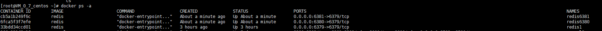
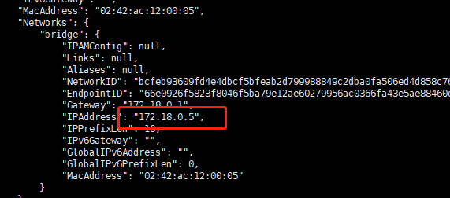
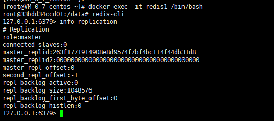
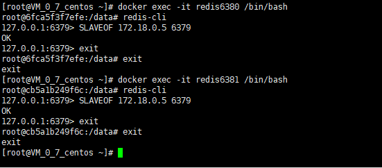
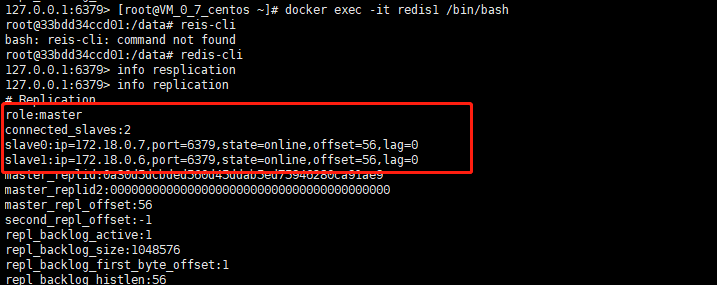

# redis集群部署
### 运行redis镜像
首先使用docker启动3个redis容器服务，分别使用到6379、6380、6381端口
```
docker run --name redis1 -p 6379:6379 -d redis
docker run --name redis6380 -p 6380:6379 -d redis
docker run --name redis6381 -p 6381:6379 -d redis
```

### 配置redis集群
查看容器内网的ip地址等信息
```
docker inspect redis1v 
```
  
3个redis的内网ip地址为：
```
redis1：172.18.0.5:6379
redis-6380：172.18.0.6:6379
redis-6381：172.18.0.7:6379
```

进入docker容器内部，查看当前redis角色（主还是从）  

  
可以看到当前3台redis都是master角色，使用redis-cli命令修改redis6380、redis6381的主机为172.18.0.5:6379
```
SLAVEOF host port // SLAVEOF 172.18.0.5 6379
```
  
查看redis-6379是否已经拥有2个从机：  
  

```
此时遇到了一个问题，设置了主从之后，master上本来是一直无法显示从节点  直到我把master重启了一次才出现，具体原因未知，先记录一下
```
至此，redis下的简单主从配置就ok了。